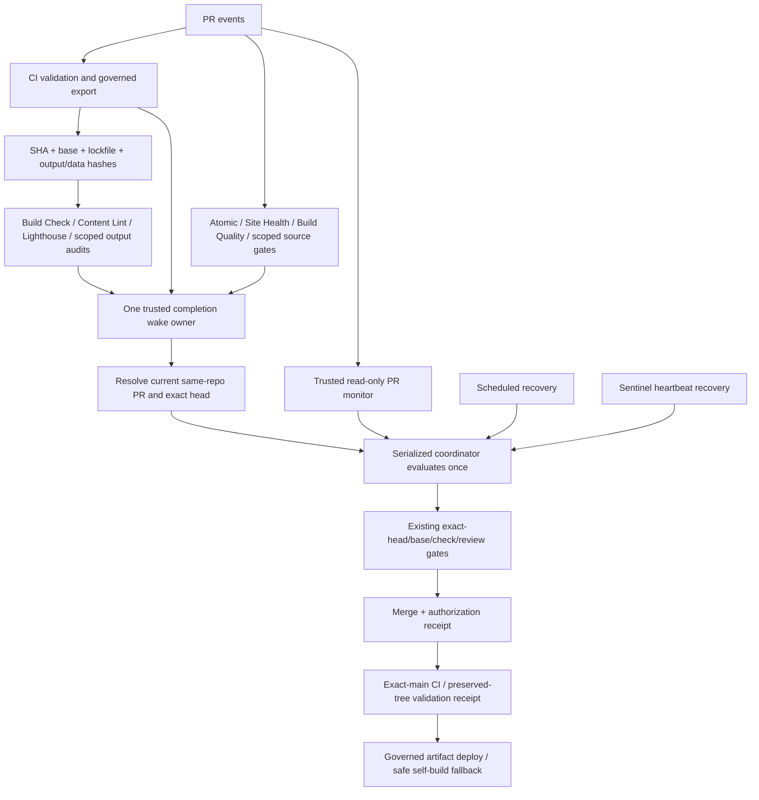

# Actions efficiency audit — P0 #5941

Status: implementation and validation in progress; the overall efficiency mission is **not complete**.

Baseline source: GitHub REST Actions runs/jobs and merged PRs, captured 2026-09-25 against main `05251bf961d9e25e4a23b9b66678406a85c37d83`. Implementation scope: one owner-directed control incident, not a general workflow rewrite. Scientific content and normal Authority/Content #5703 are outside this change.

## Measurement and baseline

Window: **2026-09-25 00:00:00 UTC inclusive to 21:30:00 UTC exclusive**. The collector searches hourly shards, refuses a 1,000-result shard, paginates jobs with `filter=all`, deduplicates job IDs and includes every available attempt. It sums full job elapsed durations for runs **created** in the window. This is approximate runner usage, not rounded billable minutes. Jobs can finish beyond the boundary; equal-window future comparisons must use this same settled-cohort convention.

The denominator is reviewed product changes #5933, #5938 and #5940 (new fail-closed evidence anchors). State-only governor lease #5936 is recorded but excluded from useful product throughput. This classification does not assert scientific promotion, traffic, revenue, or user benefit measurement. All-merge ratios are also retained so maintenance is not hidden. These are period throughput ratios, not causal attribution of every run to one PR; #5933 began before the window.

| Metric | Before | After observed | Improvement |
|---|---:|---:|---:|
| Workflow runs | 650 | Unknown | Unknown |
| Success / failure / cancelled / skipped | 248 / 88 / 159 / 155 | Unknown | Unknown |
| Job elapsed minutes | 659.067 | Unknown | Unknown |
| Jobs / unfinished jobs | 742 / 0 | Unknown | Unknown |
| Runs with no executed steps | 309 | Unknown | Unknown |
| Rerun attempts beyond first | 0 | Unknown | Unknown |
| Executed core validation runs | 216 | Unknown | Unknown |
| Repeated workflow/SHA candidate groups | 21 | Unknown | Unknown |
| Expensive build-step executions / repeated-SHA build groups | 28 / 4 | Unknown | Unknown |
| Controller invocations | 154 | Unknown | Unknown |
| Controller cancellations | 105 (68.182%) | Unknown | Unknown |
| Useful product merges / all merges | 3 / 4 | Unknown | Unknown |
| **Actions minutes per useful merge** | **219.689** | **Unknown** | **Unknown** |
| **Workflow executions per useful merge** | **216.667** | **Unknown** | **Unknown** |
| Minutes / runs per all merges | 164.767 / 162.5 | Unknown | Unknown |
| Ready → validated → merged | Unknown: no authoritative ready timestamp captured | Unknown | Unknown |

First successful deploy workflow completion after merge: #5933 4.967 minutes, #5936 12.683 minutes, #5938 30.067 minutes, #5940 4.217 minutes. These are workflow receipts, not an independent live-site probe. PR creation-to-merge timings are separate diagnostics in [summary.json](summary.json), never mislabeled readiness.

The latest-100 lead was independently reproduced: 29 controller invocations, 7 successes, 22 cancellations (75.862%). The fixed window is the primary baseline; do not compare that short burst to a quiet after period.

Reproduction (PowerShell or shell, substitute an output directory):

```text
node scripts/ci/actions-efficiency-report.mjs --from=2026-09-25T00:00:00Z --to=2026-09-25T21:30:00Z --out=<directory> --useful=5933,5938,5940
node scripts/ci/actions-efficiency-report.mjs --inventory=<directory>
node scripts/ci/actions-efficiency-report.mjs --from=<same-from> --to=<same-to> --out=<directory> --snapshot=<snapshot.json> --useful=5933,5938,5940
```

The collector writes the raw API snapshot and summary. Raw snapshots and full workflow-source JSON remain local audit artifacts rather than duplicating repository source in Git. The committed summary preserves run/job IDs for build executions and exact SHA keys for repeated validations. A repeated workflow/SHA is only a **duplicate candidate**: source tree, base, inputs, artifact identity and required audit class must match before eliminating it. Skipped conclusions and zero-step runs are not conflated with successful no-op coordinators.

## Complete trigger graph and indirect edges

[Workflow inventory](workflow-inventory.md) enumerates all **69 post-change definitions** (70 before removal of `governed-consumer-wake.yml`), event classes, path filters, schedules, workflow concurrency, reusable calls, and costly work classes. Re-run the inventory command for exact job/step predicates. The baseline controller had eight completion subscriptions and a separate three-consumer completion bridge.



The diagram is conceptual: not every scoped output audit has a direct completion subscription. Existing scheduled recovery covers those tails and provider-suppressed `workflow_run` cascades; subscription gaps remain a measured follow-up, not a claim of immediate wake reliability.

Indirect edge register, checked against workflow and executable source:

| Producer | Downstream edge and guard |
|---|---|
| CI | Explicit dispatch of Build Check, Lighthouse and Production Content Lint for PRs; main omits Build Check. Changed files add Production Content Invariants, Crawl Governance, Schema/Media and Technical SEO. Producer run/SHA/base/PR inputs bind artifacts; registration is checked before producer completion. |
| Merge controller | `update-branch` then registered canonical validation dispatches; bounded transient rerun API; final merge creates main activity; explicit deploy fallback only when neither CI nor deploy is registered. Recovery consumer ownership already excludes three CI-owned consumers. |
| Consumer completion (before) | Both direct controller `workflow_run` and Governed Consumer Wake → targeted controller dispatch for Build Check/Lighthouse/Content Lint. Duplicate ownership removed here. |
| Governor transaction and hourly maintenance | Shared non-cancelling `enrichment-governor-persistent-writer` lock; validated state diff → issue/PR → explicit CI, Site Health, Atomic and Build Quality dispatch. Maintenance returns when no diff; exact-main comparison precedes publication. |
| Owner control bridge | Owner-only issue commands dispatch governor transaction, Metricool preparation, or canonical PR readiness validations. Owner authorization and trusted-main boundaries retained. |
| Sentinel | Half-hourly health query; stale heartbeat → one controller dispatch and bounded confirmation. Workflow-specific heartbeat lookup is a follow-up because a global latest-100 query can exclude the heartbeat during bursts. |
| Stale Actions reaper | Hourly bounded stale-run cancellation, with same-PR/head/event guards in its existing script. It is not merge eligibility authority. |
| Master Research Pipeline | Seven sequential local reusable-workflow references: agent, patch QA, relationship graph, SEO assets, product intelligence, build candidates, review patches. Referenced workflows currently expose dispatch rather than `workflow_call`; treat the master entry as an unverified/broken dormant path, not proven live useful execution. |
| Research/decay/maintenance | Scheduled diagnostics can create deduplicated issue payloads; research maintenance deduplicates open issues by stable marker. Generated issues do not independently grant implementation admission or publication authority. |
| Source expansion / deep enrichment / patch packaging / runtime refresh | Manual bounded source/patch/artifact operations; inspect their generated diffs through existing workbook/governor contracts. No new automatic publication or direct-main mutation is authorized by this audit. |

Schema/media, evidence identity, workbook, scientific production checks, localization, security, enrichment safety, distribution/Metricool, SEO and measurement workflows are retained in the inventory. Their separate authorities are not removed because they run on a shared SHA.

## Verified waste and root causes

1. **Controller preemption across trigger classes.** Workflow-level `cancel-in-progress: true` overrode the non-cancelling job merge lock. Workflow completions, schedules and untargeted dispatches shared `fallback`. Example: [dispatch 36185613350](https://github.com/Razzleberrytt/hippie-scientist-site/actions/runs/36185613350) at 20:24:50 UTC was followed by completion wake 36185625766 seven seconds later and cancelled. The baseline includes 97 cancelled completion controllers, seven cancelled PR monitors and one cancelled dispatch.
2. **Duplicate completion ownership.** Three consumer completions could produce both direct controller and bridge activity. The bridge itself ran 51 times in the fixed window, often skipped. Removing its subscription structurally eliminates that extra workflow, without giving PR consumer code privileged write tokens.
3. **Untargeted completion sweeps and runner polling.** Completions previously swept all open PRs regardless of native PR, main push, skipped/failing source, or current head. Targeted dispatches could poll for three minutes. New wake classification resolves current PR identity; one evaluation returns on pending/refreshed state.
4. **Producer/branch registration race.** Three failed CI jobs reached `Dispatch exact-head governed export consumers`; [36144294529](https://github.com/Razzleberrytt/hippie-scientist-site/actions/runs/36144294529) completed expensive build/audits but timed out registering Build Check for source `625ea9efb738d3a6728ca38223c27f9891c32f9c`. Fourteen consumer jobs failed the early stale-producer guard. Preserve the guard; investigate immutable dispatch identity and producer freshness before dispatch.
5. **Review-blocked retries are not infrastructure failures.** [Controller 36078957399](https://github.com/Razzleberrytt/hippie-scientist-site/actions/runs/36078957399) reached the merge API and received HTTP 405 because a conversation remained unresolved. This must wait for review-state change, never bypass it. Review-blocked periodic attempts remain follow-up debt.
6. **Source/build reuse already exists.** CI supplied 12 successful governed-export upload steps in the baseline, and downstream consumers verified receipts. Remaining fallback builds require artifact-miss/input analysis, not a second generic build-cache layer.

Job-minute leaders: CI 257.50; deploy 61.00; Lighthouse 52.25; workbook check 51.32; schema/media 38.80; production invariants 32.80; controller 27.03. Controller churn is a serious amplification/latency defect, but eliminating its entire direct runtime would save at most 4.10% of this baseline. Large compute savings require fixing upstream invalidation and fallback builds too.

## Authority retained

| Validation class | Current authority / reuse boundary |
|---|---|
| Source validation, tests, data determinism, security | CI validation; docs/control classification and governed exact-tree main receipt may avoid equivalent work. No new fast-path classification introduced. |
| Normal same-repo production export | CI build-verification produces governed static export. Receipt verifies source SHA, base SHA, lockfile hash, output content/counts, generated verification state and build manifest. |
| Output-specific audits | Build Check, Production Content Lint/Invariants, schema/media, crawl and Technical SEO verify the producer receipt then run their distinct audit. Invalid/missing receipt retains safe rebuild. |
| Lighthouse | Governed export plus browser/mobile/desktop audit; export reuse does not substitute for Lighthouse results. |
| Workbook/source governance and identity | Workbook Patch Check and Evidence Graph Identity Check remain separate source-domain gates, including approved patch and canonical identity handling. |
| Atomic, quality, project control | Atomic PR/issue contract, generated-quality comparison, strict link-quality regression and current control reconciliation. They are not equivalent to a build. |
| Deployment | Trusted controller authorization + exact-main/preserved-tree proof + governed artifact verification, or safe self-build fallback; production receipt required. |
| Review/provider enforcement | Active `Protect main` ruleset 23041771: PR requirement, conversation resolution, deletion and non-fast-forward protection; no bypass actors. Legacy branch-protection endpoint returns 404, which does **not** mean the ruleset is disabled. Required status checks are not configured in this ruleset; controller policy remains a separate release gate. |

No threshold, required gate, scientific check, source approval, artifact trust rule, deployment authorization, review contract or repository protection was removed.

## Failure policy

| Class | Treatment |
|---|---|
| Transient / infrastructure | Existing controller caps retries at one additional attempt for its explicit non-semantic conclusion set. Scheduled recovery retained. Timeout is not proof of transience; log-based classification is follow-up debt. |
| Deterministic code/data | Fail closed; new completion wake ignores failed producers and does not blindly redispatch them. Repair source before retry. |
| Stale/superseded | Reject before costly consumer setup; current-head wake lookup prevents old completions sweeping unrelated PRs. Producer prevention remains follow-up. |
| Orchestration race | Preserve running coordinator; coalesce pending arrivals; return after one evaluation. Exact-head/base revalidation remains mandatory immediately before merge. |
| Dependency/upstream | Wait for producer proof; missing output never becomes a successful validation. Safe fallback rebuild remains until equivalent artifact authority is proven. |
| Review/authorization | Unresolved conversations and provider rules block merge. No override or auto-resolution introduced. |

GitHub concurrency still replaces pending runs; `cancel-in-progress: false` prevents cancellation of **running** work, not every possible cancelled conclusion. No FIFO or zero-cancellation claim is made.

## Changes and validation

- Reconfigured the existing merge controller; no second coordinator or receipt system.
- Removed the redundant Governed Consumer Wake workflow; consumers retain read-only Actions permissions.
- Added a dependency-free trusted wake classifier and single-pass controller mode.
- Added reproducible read-only measurement/inventory tooling, explicit denominator handling and regression tests.
- Focused validation: 81 Node-project tests (including the real single-pass controller subprocess and existing artifact/deploy authorization regressions) and 19 app-project contract tests passed. Documentation link validation passed across 335 Markdown files. Final exact-head hosted validation remains pending.
- Local combined Vitest invocation exposed differing project worker limits with equal default group order; running each existing project independently passed. Hosted scripts-node uses one worker and follows Vitest's isolated-single-worker path. No test exclusions or worker policy were changed.
- Local production build attempts failed on Windows `UNKNOWN` file-write errors in production invariant generation, first `compounds-detail/skullcap.json`, then `compounds.json`. One bounded retry was attempted; hosted Linux production proof is required. Generated outputs from these attempts are excluded from this control change.
- User-facing rendering is unchanged; visual browser verification is not applicable to this coordinator-only change.

## Next optimizations, ranked by expected ROI and risk

| Rank | Candidate | Expected saving / evidence | Risk / required proof |
|---:|---|---|---|
| 1 | Prevent stale producer dispatch / registration races | High: 3 costly CI registration failures and 14 rejected consumers in this cohort | Medium: prove head/ref/base coherence and that no required current-head validation disappears. Existing #5231/#5871 overlap must be reconciled before admission. |
| 2 | Diagnose receipt misses and collapse residual build fallbacks | High: deploy 61 min plus seven consumer classes; build-once system already implemented | Medium/high: compare exact source/base/tree/lockfile/generated-state and artifact provenance before reuse. |
| 3 | Coalesce readiness events before runner allocation; durable review-blocked state | Medium: 154 controller invocations; 51 removed bridge invocations are a structural opportunity | Medium: preserve final-consumer wake and provider recursion recovery. Do not trade fewer runs for merge starvation. |
| 4 | Workbook/source-class validation partitioning | Medium: 51.32 min | High: protect canonical source, approved patches, generated-runtime parity and evidence identity. |
| 5 | Cheap governor/maintenance no-change preflight | Medium/low: scheduled install/tests precede diff check | Medium: external lease/time changes matter even when Git SHA is unchanged; cache source state only when all external inputs are bound. |
| 6 | Sentinel workflow-specific heartbeat query; retry taxonomy | Reliability gain, modest direct compute | Low/medium: avoid global latest-100 starvation; never clear failures using skipped/cancelled retries. |
| 7 | Repair or explicitly retire dormant master research entry | Unknown compute saving; live useful execution unproven | Medium: referenced workflows need valid reusable contracts and deliberate artifact transfer before activation. |
| 8 | Cache/install/Lighthouse micro-optimizations | Lower priority until invalidation races are fixed | Preserve browser coverage, security checks, dependency integrity and export provenance. |

Structural projections are **not measured after improvements**. If the same baseline event stream occurred without the bridge, 51/650 executions (7.85%) would be absent before accounting for changed downstream behavior. Actual minutes/useful merge, duplicate validation reduction, cancellation reduction and autonomous merge/deploy continuity still require a settled post-change cohort. Do not close the overall mission on this projection.
