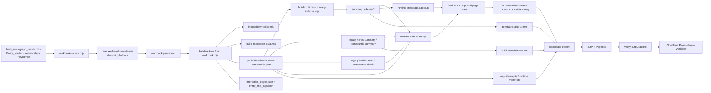

# Cluster Member Runtime Trust Contract Discovery

Date: 2026-07-15  
Scope: `runtime_export_decision = cluster_member_runtime`  
Baseline: primary-runtime trust work remains complete and was not changed

## Executive summary

`cluster_member_runtime` is an explicit governance value on exactly four `Entity_Master` rows. It is not an implemented inheritance system. The four rows are two herbs (`green-tea-extract`, `turmeric`) and two compounds (`green-tea-egcg-isolated`, `green-tea-extract-egcg`). No row stores a canonical parent, inherited field set, override mask, provenance, or cluster identifier.

The highest-ROI path is a small trust-contract expansion plus removal of the legacy detail-overlay ambiguity, not a schema or inheritance redesign. The core workbook builder is deterministic, but page loaders merge independently maintained `*-summary.json`, `summary-indexes/*`, and `*-detail/:slug.json` payloads after the workbook record. All four cluster members are detail-overridden. Those overlays replace specific workbook safety notes with `Generally well tolerated for most users.` and introduce other semantic and indexability drift.

The production export proves this is user-visible:

- `green-tea-extract` and `turmeric` export as indexable pages but show the generic safety statement in the page and JSON-LD.
- `green-tea-egcg-isolated` and `green-tea-extract-egcg` export as `Compound Not Found`, `noindex, follow`, canonicalized to the homepage, and excluded from the sitemap even though their workbook/list records are `PUBLISH` and their static parameters are discoverable.
- No cluster member has an evidence-labelled runtime safety summary.
- Three of four contraindication values are token-only.
- The existing fill-rate audit reports all four as covered because it reads workbook `safety_notes`; the core runtime builder intentionally exports only `runtime_safety` as `safety`.

Recommendation: implement Option B, “trust contract expansion,” in three small batches. First fix the two broken compound exports and define one authoritative merge contract. Then add four evidence-labelled `runtime_safety` values, three prose contraindication overrides or documented exceptions, and structured adverse-effect handling. Finally enable the new cluster audit in strict CI. Do not build general field inheritance yet.

## Exact population and counts

Counts are from the workbook, generated JSON, effective loader merge, search index, and the completed production export.

| Metric | Exact count | Percentage / definition |
|---|---:|---:|
| Cluster member runtime profiles | 4 | 100% |
| Canonical `Entity_Master` rows | 4 | 100% |
| Rows typed `compound` | 2 | 50% |
| Rows typed `herb` | 2 | 50% |
| Profiles with declared inheritance | 0 | 0% |
| Profiles with a detail overlay | 4 | 100% |
| Profiles with at least one value overridden by detail | 4 | 100% |
| Exact duplicate final summaries | 0 | 0% |
| Evidence-labelled effective safety summaries | 0 | 0% |
| Missing final user-visible summary values | 0 | 0% |
| Structured safety gaps | 11 | 4 labels + 3 prose contraindications + 4 adverse-effect fields |
| Runtime defect instances | 10 | Across 4/4 profiles |
| Rendering defect instances | 4 | Generic FAQ/schema safety across 4/4 profiles |
| Broken exported profile pages | 2 | 50% of the population; consequences of list/detail drift |
| Audit false-positive instances | 4 | 4/4 profiles counted as complete by the fill-rate audit |

“Canonical compounds” can be ambiguous here. The exact typed count is two compound rows. All four rows are canonical workbook entities, but none declares a canonical parent. Nearby likely consolidation targets exist (`camellia-sinensis`, `epigallocatechin-gallate-egcg`, `curcumin`, and related curcuminoids), but the data model does not authorize treating any of them as the parent of a cluster-member row.

## Profile inventory

| Slug | Type | Workbook safety | Contraindication class | Effective detail safety | Export result |
|---|---|---|---|---|---|
| `green-tea-extract` | herb | Hepatotoxicity risk at high doses | PROSE | Generic well-tolerated claim | 200-style static page; indexable; sitemap included |
| `turmeric` | herb | GI, anticoagulant, surgery, gallbladder, pregnancy/breastfeeding cautions | TOKEN_ONLY | Generic well-tolerated claim | 200-style static page; indexable; sitemap included |
| `green-tea-egcg-isolated` | compound | Rare hepatotoxicity; fasting/high-dose and liver-disease caution | TOKEN_ONLY | Generic well-tolerated claim | Exported `Compound Not Found`; noindex; homepage canonical |
| `green-tea-extract-egcg` | compound | Concentrated-extract liver injury, especially high-dose/fasting | TOKEN_ONLY | Generic well-tolerated claim | Exported `Compound Not Found`; noindex; homepage canonical |

## Runtime architecture

### Dependency graph



The critical architectural fact is the four-way page merge, in order:

```text
herbs.json / compounds.json
  <- legacy herbs-summary.json / compounds-summary.json
  <- summary-indexes/herbs-summary.json / compounds-summary.json
  <- herbs-detail/:slug.json / compounds-detail/:slug.json
```

Later objects win. A stale detail value can therefore defeat the workbook source, current indexability policy, search summary, and trust contract.

### Source and normalization

- `data-sources/herb_monograph_master.xlsx`
  - `Entity_Master` is the authoritative profile table.
  - `Entity_Relationships` supplies herb/compound and semantic edges.
  - `Evidence_Register` and `Source_Register` supply claim/source context.
  - `Entity_Runtime_Overlay` contains no rows for the four targets.
- `scripts/workbook-source.mjs` resolves the local workbook.
- `scripts/utils/read-workbook-exceljs.mjs` reads it. The full model fails on this workbook and the reader normalizes OOXML and uses its streaming fallback.
- `scripts/data/workbook-parser.mjs` exposes normalized sheets/rows.
- `scripts/data/build-runtime-from-workbook.mjs` selects fields, normalizes mechanisms/lists/slugs, scores visibility, derives interaction artifacts, and writes the top-level runtime lists.
- `config/runtime-herb-fields.mjs` and `config/runtime-compound-fields.mjs` define allowed runtime fields.
- `scripts/data/indexability-policy.mjs` produces `PUBLISH`, `NEEDS_REVIEW`, `NOINDEX`, or `BLOCKED`.
- `scripts/data/build-interaction-data.mjs` converts safety/contraindication tokens into risk tags and supplement-to-supplement mechanistic edges.

The builder reads `runtime_safety` into runtime `safety`. It does not export `safety_notes` as runtime safety. This is intentional and duplicated in `scripts/data/canonical/site-export.mjs` lines 159–163.

### Generated runtime and optional overlays

Core deploy artifacts:

- `public/data/herbs.json`
- `public/data/compounds.json`
- `public/data/herb-index.json`
- `public/data/compound-index.json`
- `public/data/herb-compound-map.json`
- `public/data/interaction_edges.json`
- `public/data/entity_risk_tags.json`
- `public/data/claims.json`
- `public/data/knowledge-graph.json` and related taxonomy/graph JSON

Derived artifacts:

- `scripts/data/build-related-runtime-maps.mjs` -> `public/data/runtime-maps/*`
- `scripts/data/build-runtime-summary-indexes.mjs` -> `public/data/summary-indexes/*`
- `scripts/data/canonical/citation-export.mjs` can update detail citation payloads during summary generation.
- `scripts/data/ai-entity-enrichment-lib.mjs` creates AI retrieval artifacts during summary generation.
- `scripts/data/build-route-manifest.mjs` -> `public/data/runtime-manifests/route-manifest.json`
- `scripts/data/build-internal-link-engine.mjs` -> link/topic maps
- `scripts/data/build-sitemap-manifest.mjs` -> sitemap chunk manifest
- `scripts/data/build-export-batches.mjs` -> export batches
- `scripts/data/build-semantic-snapshots.mjs` -> runtime semantic snapshots
- `scripts/data/build-search-index.mjs` -> `public/data/search-index.json`

The full `data:build` path also runs `scripts/data/postprocess-workbook-payloads.mjs` and `scripts/data/apply-governance-overlay.mjs`. The production deploy path does not. `postprocess-workbook-payloads.mjs` creates the generic safety default, while `apply-governance-overlay.mjs` reconciles and mutates detail/list governance. `scripts/ci/guard-no-full-build-drift.mjs` explicitly documents this difference. This split pipeline is a principal maintenance risk.

Legacy/enrichment artifacts still consumed at page time:

- `public/data/herbs-summary.json`
- `public/data/compounds-summary.json`
- `public/data/herbs-detail/*.json`
- `public/data/compounds-detail/*.json`

The core workbook builder does not regenerate the plural detail folders; its detail writes are commented out. Git history confirms these files were produced and patched by older enrichment/governance workflows. They are nonetheless authoritative at the final merge boundary.

### Runtime loaders, rendering, schema, and search

- `src/lib/runtime-data.ts` reads and merges lists, legacy summaries, summary indexes, and per-slug detail records.
- `src/lib/runtime-summary-indexes.ts` loads compact summary artifacts.
- `src/lib/runtime-metadata-cache.ts` supplies metadata from summary indexes only.
- `src/lib/runtime-record-index.ts` unifies herbs and compounds for related/profile logic.
- `src/lib/react-cache.ts` memoizes loader results during static generation.
- `lib/runtime-visibility.ts` computes render/index/feature/monetize decisions.
- `src/types/content.ts` defines loose runtime record types.
- `app/herbs/[slug]/page.tsx` and `app/compounds/[slug]/page.tsx` generate static params, metadata, visible safety, FAQs, and profile schema.
- `lib/compound-trust.ts` parses `Safety evidence:` labels and generates compound guidance.
- `lib/safety-classification.ts`, `lib/profile-decision.ts`, and `lib/evidence.ts` feed visible trust components.
- `src/lib/schema-graph.ts`, `lib/cluster-linking.ts`, `components/seo/SchemaGraphScript.tsx`, and `src/components/herb-profile/SchemaGenerator.tsx` build structured data.
- `src/components/InteractionWarnings.tsx` renders derived supplement-pair warnings.
- `src/lib/runtime-related-maps.ts`, `lib/related-runtime.ts`, and related link components consume graph/link artifacts.
- `app/sitemap.ts`, `src/lib/seo.ts`, `scripts/seo/write-static-sitemap.mjs`, and sitemap validators control SEO inclusion.
- `app/herbs/page.tsx`, `app/compounds/page.tsx`, their paginated/client components, and `lib/profile-index-records.ts` consume lean browse/index records.
- `components/search/GlobalSearch.tsx`, `components/search/GlobalSearchModal.tsx`, `components/search/search-ui.tsx`, and `public/data/search-index.json` expose client search.
- `scripts/build-deploy.mjs`, `scripts/build-production.mjs`, `next.config.mjs`, and Pagefind produce the static output.

### Audits, validation, tests, and deployment

Trust/safety/index audits:

- `scripts/audit-trust-completeness.mjs`
- `scripts/audit-safety-fill-rate.mjs`
- `scripts/audit-severity-token-contraindications.mjs`
- `scripts/audit-indexation.mjs`
- `scripts/audit-content-quality.mjs`
- `scripts/ci/validate-safety-visibility.mjs`
- `scripts/ci/validate-evidence-language.mjs`
- `scripts/ci/validate-indexability-metadata.mjs`
- `scripts/ci/validate-data-governance.mjs`
- `scripts/ci/validate-workbook-source.mjs`
- `scripts/ci/validate-workbook-schema.mjs`
- `scripts/ci/validate-workbook-json-parity.mjs`
- `scripts/data/verify-generated-data.mjs`
- `scripts/ci/audit-structured-data.mjs`
- `scripts/ci/audit-seo-routes.mjs`
- `scripts/ci/validate-sitemap.mjs`
- `scripts/ci/validate-sitemap-completeness.mjs`

Relevant tests:

- `app/__tests__/runtime-visibility.test.ts`
- `lib/__tests__/compound-trust.test.ts`
- `src/lib/__tests__/schema-graph.test.ts`
- `src/lib/__tests__/seo.test.ts`
- `components/seo/__tests__/SchemaGraphScript.test.ts`
- `app/__tests__/sitemap-last-modified.test.ts`
- `app/__tests__/compare-sitemap-integrity.test.ts`
- `scripts/audit-severity-token-contraindications.test.mjs`
- `scripts/data/build-interaction-data.test.mjs`

New read-only audit and test:

- `scripts/audit-cluster-member-trust.mjs`
- `scripts/audit-cluster-member-trust.test.mjs`
- package command: `npm run audit:cluster-member-trust`
- optional future enforcement: `npm run audit:cluster-member-trust -- --strict`

Deployment dependencies:

- `package.json` build/validation scripts
- `next.config.mjs` with `output: 'export'`
- `public/_headers` and `public/_redirects`
- `.github/workflows/ci.yml`, `.github/workflows/check.yml`, `.github/workflows/build-check.yml`
- `.github/workflows/deploy.yml` builds, verifies, and deploys `out/` to Cloudflare Pages

## Trust contract analysis

| Trust principle | Current state | Exact result | Classification |
|---|---|---:|---|
| Evidence-labelled safety summary | No `runtime_safety`; effective detail is unlabelled | 0/4 | Cluster-specific override |
| Contraindications | One prose; three empty/severity tokens | 1/4 prose | Cluster-specific override |
| Warnings | Present only as workbook narrative; not canonical runtime | 0/4 contract-complete | Schema limitation / override |
| Precautions | Same as warnings | 0/4 contract-complete | Schema limitation / override |
| Pregnancy | Only turmeric mentions it in non-exported workbook safety | 1/4 source; 0/4 effective detail | Cluster-specific override |
| Breastfeeding | Only turmeric mentions it in non-exported workbook safety | 1/4 source; 0/4 effective detail | Cluster-specific override |
| Surgery | Only turmeric mentions it in non-exported workbook safety | 1/4 source; 0/4 effective detail | Cluster-specific override |
| Age restrictions | No structured or narrative coverage | 0/4 | Evidence-limited until researched |
| Adverse effects | Turmeric mentions GI effects only in source narrative; arrays empty | 0/4 structured | Cluster-specific override |
| Evidence limitations | No safety evidence labels; scattered efficacy caveats only | 0/4 contract-complete | Cluster-specific override |
| Uncertainty handling | Some summaries use moderate/caution framing, but safety defaults assert tolerance | Inconsistent 4/4 | Runtime defect |
| Fallback behavior | Generic default wins over specific source safety | Defective 4/4 | Runtime defect |
| Runtime consistency | List, detail, metadata, search, and export disagree | Defective 4/4 | Runtime defect |
| User-visible completeness | Two misleading herb pages; two compound 404 exports | Complete 0/4 | Rendering consequence |

Age, pregnancy, lactation, surgery, and adverse-effect gaps must not be filled merely for completeness. Each requires source review. An evidence-limited exception is valid if the review cannot support categorical guidance.

## Inheritance analysis

There is no semantic inheritance. The only inheritance-like behavior is untyped object spreading in the loader.

| Runtime field/group | Actual behavior | Assessment |
|---|---|---|
| Identity (`slug`, `name`) | Duplicated across list/summary/detail; later detail can override | Dangerous duplication |
| Summary/description | Generated from workbook, then often overridden by legacy summary/detail | 3/4 summaries change between layers; no exact final duplicates |
| Evidence tier/grade | Usually retained from workbook because detail fields are blank/missing | Accidental carry-through, not declared inheritance |
| `safety` / `runtime_safety` | Generated only when workbook `runtime_safety` exists; absent for all four | Correct source rule, incomplete data |
| `safetyNotes` | Supplied by stale detail; wins in render/FAQ/schema selection | Dangerous override |
| Contraindications | Generated list, sometimes backfilled into detail | One prose, three token-only source values |
| Interactions | Empty in core; two herb details duplicate contraindications as interactions | Semantic corruption |
| Side effects | Empty arrays | No inheritance |
| Pregnancy warning | Runtime contract allows herb field, but builder has no matching source column mapping here | Ignored/unpopulated |
| Indexability/robots/sitemap | Scored in list, then detail can override at page load; metadata uses summary only | Inconsistent and dangerous |
| Mechanisms/effects/dose | Workbook-generated and sometimes independently duplicated in detail | Usually benign but stale-risk remains |
| Sources/evidence claim maps | Detail/citation overlay only | Useful enrichment, but should be namespaced rather than overwrite core facts |

### Beneficial inheritance

Safe inheritance candidates are narrow, explicitly versioned facts:

- canonical ingredient/form identity;
- shared hazard fragments with formulation qualifiers;
- citation/source references;
- review date and provenance;
- canonical medication class identifiers in a future interaction model.

For the three green-tea/EGCG profiles, a shared concentrated-catechin liver-risk fragment is reusable if each profile overrides dose, fasting, caffeine, and preparation scope. Turmeric must remain separate from curcumin, curcumin-piperine, or isolated curcuminoids because preparation and bioavailability change safety.

### Dangerous inheritance

- Whole-herb safety inherited by an isolated/high-dose extract.
- Food/beverage evidence inherited by concentrated EGCG.
- Turmeric food-use safety inherited by enhanced-bioavailability curcumin formulations.
- Contraindications automatically retyped as medication interactions.
- Parent certainty/evidence tier copied to a less-studied formulation.
- Parent robots/indexability copied without record-level source/review checks.
- Generic “well tolerated” defaults inherited when safety is unknown.

### Duplication and estimated edit reduction

Four profiles currently duplicate identity, summary, safety-adjacent fields, dose, mechanisms, and visibility across at least four artifact layers. Eliminating legacy summary/detail ownership would remove all four page-time safety overrides and most drift checks.

A future fragment-composition design could reduce repeated baseline safety authoring from four narratives to two family baselines (green-tea/EGCG and turmeric) plus four small qualifiers: approximately 50% of baseline narrative content is reusable. Overall trust-field editing would fall by an estimated 25–40%, because contraindications, dose, pregnancy, surgery, adverse effects, and evidence certainty still require formulation-specific review. A full inheritance engine is not justified for four profiles.

## Manual runtime verification

All four workbook rows, generated list records, legacy summary records, detail records, search documents, interaction tags/edges, and exported HTML files were inspected manually.

### `green-tea-extract`

- Workbook warning: hepatotoxicity at high dose; flags liver disease and stimulants.
- Effective page safety: `Generally well tolerated for most users.`
- Detail duplicates `Liver disease` and `stimulants` into both contraindications and interactions.
- Search correctly detects notable considerations but its summary differs from the page summary.
- Export: indexable, canonical self, sitemap included.
- FAQ and profile JSON-LD repeat the generic safety statement.

### `turmeric`

- Workbook safety includes mild GI effects, anticoagulant/antiplatelet caution, pre-surgery caution, gallbladder/bile-duct caution, and avoidance of high supplemental doses during pregnancy/breastfeeding.
- Effective page and JSON-LD reduce this to the generic well-tolerated statement.
- `Anticoagulants` and `gallstones` are duplicated into the interaction list; gallstones are not a medication interaction.
- The derived interaction engine creates numerous anticoagulant supplement-pair warnings. These are labelled mechanistic, not verified clinical interactions, but their volume is driven by token extraction.
- Export: indexable, canonical self, sitemap included.

### `green-tea-egcg-isolated`

- Workbook and base summary both identify concentrated-extract hepatotoxicity.
- Detail says generally well tolerated and downgrades indexability to `NEEDS_REVIEW`.
- Search says generally well tolerated and reports no contraindication/interaction flags.
- Production export is a `Compound Not Found` page, `noindex, follow`, homepage canonical, absent from sitemap.
- The loader returns a renderable record when invoked directly, proving a static-generation/runtime-surface inconsistency rather than a missing workbook entity.

### `green-tea-extract-egcg`

- Workbook identifies concentrated-extract liver injury, particularly high-dose or fasting use.
- Contraindication value is the token `moderate`, which generates no effective contraindication.
- Detail says generally well tolerated and downgrades indexability to `NEEDS_REVIEW`.
- Search says generally well tolerated with no flags.
- Production export is a `Compound Not Found` page, `noindex, follow`, homepage canonical, absent from sitemap.

### Negative checks

- All JSON artifacts parsed successfully; no serialization failure was found.
- No client/server hydration warning was observed. The affected compound pages fail during static generation and export as not-found content, so no profile hydration occurs.
- No exact duplicate final summary exists among the four profiles.
- No cluster member belongs to the unrelated static semantic clusters in `lib/cluster-linking.ts`; the shared word “cluster” does not create a dependency.

## Classified findings

The new audit records 30 root findings. Every finding has exactly one mission category.

| Category | Count | Notes |
|---|---:|---|
| Valid inheritance | 0 | No declared inheritance exists |
| Cluster-specific override | 11 | 4 missing labels, 3 token contraindications, 4 missing adverse-effect arrays |
| Evidence-limited exception | 0 | No cluster-member exception registry exists yet |
| Runtime defect | 10 | 4 generic safety overrides, 2 visibility divergences, 2 interaction duplications, 2 search contradictions |
| Rendering defect | 4 | FAQ/schema select generic detail safety on all four |
| Schema limitation | 1 | No parent/provenance/override contract |
| Audit false positive | 4 | Fill-rate audit counts non-exported source notes as runtime completion |
| Internal-only | 0 | None left unclassified |
| Not actionable | 0 | None left unclassified |

The two exported compound 404 pages are deployment consequences of the already-counted list/detail visibility/runtime divergence, not additional root findings.

## Existing audit assessment

### Trust completeness audit

`scripts/audit-trust-completeness.mjs` is correct for its completed 89-profile reviewed queue, but the target set is assembled from historical patch files plus `primary_runtime_priority`. It does not select `cluster_member_runtime`. Result: 89/89 passes while 0/4 cluster members have labelled safety.

### Safety fill-rate audit

`scripts/audit-safety-fill-rate.mjs` measures workbook source presence, accepting `safety_notes`. It reports 881/881 safety context. That is a useful source audit but a false positive for runtime trust because `safety_notes` is not exported as runtime `safety` by the core builder.

### Severity-token audit

`scripts/audit-severity-token-contraindications.mjs` correctly classifies values, but strict actionable enforcement covers only `full_public_runtime` compounds. It misses the token-only cluster herb and two token-only cluster compounds.

### Indexability and deployment audits

Indexability validation checks each artifact internally but does not require list/detail/metadata/page agreement for the same slug. Structured-data validation confirms syntactic schema validity, not whether safety text contradicts the source. Sitemap validation correctly excludes the exported not-found compound pages, but does not flag that their workbook/list status is `PUBLISH`.

### Recommended audit changes

1. Select target populations directly by runtime decision; do not infer them from patch history.
2. Audit both source and effective merged runtime, reporting which layer supplied each trust field.
3. Require list/detail/metadata/search/export agreement for slug, renderability, robots, canonical, and sitemap state.
4. Add normalized duplicate detection for summaries and safety narratives; exclude explicit canonical fragments from duplicate errors.
5. Store source hashes/provenance and flag stale detail/summary fields that differ from their workbook source without an approved override marker.
6. Reject unsupported certainty phrases such as generic “safe” or “generally well tolerated” when the canonical safety field is empty or cautionary.
7. Require the `Safety evidence:` label for trust-target populations.
8. Support evidence-limited exception registries by target decision and field, with stale-exception checks.
9. Keep output deterministic: sorted slugs/issues, stable JSON, no current timestamps.
10. Run the new audit in report mode immediately; enable `--strict` in `check:full` only after the four profiles are remediated.

Implemented now: the read-only deterministic cluster-member audit, JSON output, classification enforcement, tests, and opt-in strict mode. No content or medication-interaction data was changed.

## Medication interaction assessment and proposal

### Current storage and behavior

- `Entity_Master` has no dedicated medication-interaction column.
- Medication cautions are embedded in `runtime_safety`, `safety_notes`, or `contraindications_or_flags`.
- The builder attempts to read `interactions`, but the current 52-column sheet does not provide a governed interaction field.
- Legacy `herbs-detail`/`compounds-detail` files may contain string arrays named `interactions`; two cluster herbs incorrectly duplicate contraindications into this array.
- `scripts/data/build-interaction-data.mjs` derives `entity_risk_tags.json` and `interaction_edges.json` from keyword risk mechanisms. These describe supplement-to-supplement additive/mechanistic flags, not verified drug interactions.
- `src/types/interactions.ts`, `src/components/InteractionWarnings.tsx`, and the safety checker render those derived edges.
- `lib/compound-trust.ts` can narrate an existing interaction string array, but cannot represent drug, class, dose, evidence, or action separately.
- Search only exposes booleans for “has interactions” and “has contraindications.”

### Missing capabilities

- Medication identity and class normalization.
- Direction, severity, evidence level, mechanism, formulation/dose scope, onset, and recommended action.
- Separation of pharmacokinetic, pharmacodynamic, theoretical, case-report, and clinically demonstrated interactions.
- Source-level provenance and review status per interaction.
- Explicit distinction between drugs, drug classes, supplements, foods, conditions, and procedures.
- Deduplication and conflict resolution across ingredient forms.
- Evidence-limited/unknown status without asserting safety.

### Proposed schema

Use a separate `Medication_Interactions` workbook sheet and canonical collection, not more delimited text in `Entity_Master`.

```json
{
  "interaction_id": "int_green-tea-extract_statins_001",
  "entity_slug": "green-tea-extract",
  "entity_type": "herb",
  "counterparty": {
    "kind": "medication_class",
    "name": "Example class",
    "normalized_id_system": "RxNorm-or-local",
    "normalized_id": "..."
  },
  "interaction_type": "pharmacokinetic",
  "direction": "may_increase_exposure",
  "severity": "moderate",
  "evidence_level": "limited_human",
  "certainty": "possible",
  "mechanism": "Concise source-backed mechanism",
  "clinical_effect": "Concise source-backed consequence",
  "recommended_action": "review_with_clinician",
  "scope": {
    "formulation": "concentrated extract",
    "dose": "source-specific",
    "population": "source-specific"
  },
  "source_ids": ["src_..."],
  "review_status": "approved",
  "last_reviewed": "YYYY-MM-DD",
  "notes": ""
}
```

Enums should be closed and validated. `severity` should describe clinical consequence; `evidence_level` and `certainty` must remain separate.

### Migration and compatibility

1. Inventory existing narrative interaction clauses without publishing extracted rows.
2. Human-review and normalize medication/class identities.
3. Add the new sheet and canonical JSON export behind a feature flag.
4. Keep current `interactions: string[]` as a derived compatibility projection from approved structured rows.
5. Continue rendering existing narrative safety when no structured rows exist.
6. Do not translate derived supplement-pair risk edges into medication interactions.
7. After parity, make structured rows authoritative and retain narrative fields for explanation only.

### Validation, rendering, testing, and future audits

- Validate slug existence, unique interaction IDs, enums, source IDs, review status, and required scope for extract/form-specific claims.
- Reject medication rows with no source, no action, or unsupported absolute certainty.
- Render a compact table grouped by medication/class, with evidence and action visible before mechanism details.
- Keep general safety, contraindications, and medication interactions as distinct sections.
- Test schema parsing, compatibility projection, deduplication, source links, severity ordering, empty states, accessibility, and static export.
- Audit orphan medication IDs, conflicting actions, stale reviews, inherited scope leakage, duplicate normalized pairs, and narrative/structured disagreements.

This proposal is design only. No interaction data or renderer was implemented.

## ROI options

| Option | Engineering effort | Files affected | Safety improvement | Maintenance reduction | SEO improvement | User trust | Regression risk | Complexity |
|---|---:|---:|---|---|---|---|---|---|
| A — Minimal fixes | 10–16 h | 8–12 | High for 4 profiles; restores two pages | 10–20% | High: recovers two compound URLs | High immediate | Low–medium | Low |
| B — Trust contract expansion | 24–36 h | 14–22 | Very high; contract parity plus merge guardrails | 30–45% | High | Very high | Medium | Medium |
| C — Schema redesign | 70–110 h | 30–50 | High long-term, little extra immediate gain | 45–60% | Medium | High | High | High |
| D — Inheritance redesign | 44–72 h | 20–35 | Medium; can create unsafe form leakage | 35–50% | Low–medium | Medium | High | High |

### Recommendation

Choose Option B, delivered incrementally. It absorbs Option A’s urgent corrections, preserves the workbook as source of truth, removes the dangerous untyped overlay behavior, completes the same evidence-labelled contract, and adds enforceable audits. Option C is appropriate only when the medication-interaction system or a larger formulation-family program is approved. Option D is premature: four profiles do not justify a general inheritance engine, and formulation-specific safety makes naive reuse risky.

Expected result of Option B:

- 4/4 labelled runtime safety summaries;
- 4/4 explicit prose contraindication or documented evidence-limited exception decisions;
- 4/4 correct exported pages and self-canonicals according to approved visibility;
- zero generic safety contradictions;
- 30–45% maintenance reduction for these profiles by eliminating redundant artifact ownership;
- approximately 50% reusable family-level baseline safety content, with formulation qualifiers retained.

## Prioritized implementation roadmap

### Batch 0 — Export and ownership repair

- Scope: reproduce and fix the two compound not-found exports; define list/detail/metadata precedence; stop stale detail from overriding core trust/visibility fields.
- Estimated edits: 8–12 code/test/artifact-contract edits.
- Duration: 1–2 engineering days.
- Risk: medium because loaders affect all profiles; constrain behavior to authoritative-field ownership and add parity tests first.
- Validation: targeted loader tests, static params, metadata, four exported HTML pages, sitemap, structured-data audit, full build.
- Rollback: revert loader ownership change and restore prior detail merge; no route rename or redirect required.
- Dependencies: none.
- User impact: restores two broken compound pages and prevents contradictory visibility.

### Batch 1 — Four-profile trust completion

- Scope: source review for four `runtime_safety` values, three token contraindications, adverse effects, pregnancy/lactation/surgery/age decisions, and exception registry if evidence is insufficient.
- Estimated edits: 8–16 workbook cells plus 0–4 exception entries; generated core JSON only.
- Duration: 1–2 editorial/engineering days, dominated by evidence review.
- Risk: low–medium; formulation overgeneralization is the primary risk.
- Validation: workbook dry run/apply, schema, roundtrip, core data build, source parity, new strict audit, severity audit.
- Rollback: reverse targeted workbook patch and rebuild core artifacts.
- Dependencies: Batch 0 ownership contract.
- User impact: evidence-labelled, non-misleading safety on all four profiles.

### Batch 2 — Cross-surface trust enforcement

- Scope: extend trust/index audits to effective merge, search, metadata, JSON-LD, and export; enable strict cluster audit in CI.
- Estimated edits: 6–10 code/test/workflow edits.
- Duration: 1 engineering day.
- Risk: low after Batch 1; initial CI failures may reveal unrelated stale overlays.
- Validation: audit unit tests, full Vitest, `check:full`, production export and output verification.
- Rollback: keep report mode and remove only the strict CI invocation.
- Dependencies: Batches 0–1.
- User impact: prevents recurrence and protects SEO/trust parity.

### Batch 3 — Optional consolidation design

- Scope: decide whether overlapping green-tea/EGCG and turmeric/curcumin routes are distinct formulations, aliases, or canonical consolidations; no automatic redirects.
- Estimated edits: discovery only, then separately scoped route/content work.
- Duration: 1–2 days discovery.
- Risk: high SEO risk if routes are consolidated incorrectly.
- Validation: search intent, backlink/internal-link inventory, content differentiation, redirect plan.
- Rollback: no mutation during discovery; any later route change must add `public/_redirects` entries.
- Dependencies: stable trust data.
- User impact: reduced duplication and clearer formulation choices if evidence supports consolidation.

### Deferred — Structured medication interactions

- Scope: the separately approved schema proposal above.
- Duration: 2–4 weeks depending on curation volume.
- Risk: high/YMYL.
- Dependencies: source registry maturity and explicit product approval.
- User impact: potentially high, but not required to complete the four-profile trust contract.

## Risk assessment

| Risk | Likelihood | Impact | Mitigation |
|---|---|---|---|
| Stale detail overrides recur | High | High | Single ownership contract plus cross-layer parity audit |
| Extract safety inherited from food/whole herb | Medium | High | Formulation scope required on every shared fragment |
| Two compound URLs remain silent 404 exports | High without fix | High | Built-HTML assertions for title, canonical, and safety section |
| Generic certainty enters fallback | High | High | Ban generic tolerance fallback for unknown/cautionary safety |
| Strict audit blocks unrelated work | Medium | Medium | Report mode now; strict only after remediation |
| Workbook streaming reader complicates edits | Medium | Medium | Targeted XML editor, roundtrip test, core-only rebuild |
| Full/core pipeline divergence | High | High | Converge or formally isolate overlay stages; test deploy command |
| Premature canonicalization harms SEO | Medium | High | Preserve routes; research intent and redirect plan separately |
| Interaction extraction creates false clinical claims | Medium | High | Human review, source requirement, separate mechanistic edges |

## Unknowns requiring explicit decisions

1. What did the original `cluster_member_runtime` governance value mean: alias family, formulation family, semantic cluster, or promotion tier? No current document defines it.
2. Should the two compound profiles remain indexable distinct pages after content differentiation, or consolidate into `epigallocatechin-gallate-egcg`?
3. Should `green-tea-extract` remain distinct from `camellia-sinensis` and the EGCG compound pages?
4. Is the herb-typed `curcumin` profile intentional, and is it relevant to turmeric consolidation?
5. Which pipeline owns plural detail files after a deploy build? Current code and comments disagree operationally.
6. Should record-level source governance be enforced in the deploy path or removed from page-time detail ownership?
7. What evidence threshold should qualify a cluster-member evidence-limited exception?

## Validation performed

Discovery and baseline commands:

```text
git status --short
git branch --show-current
node scripts/audit-trust-completeness.mjs
node scripts/audit-severity-token-contraindications.mjs
node scripts/audit-safety-fill-rate.mjs
node scripts/audit-content-quality.mjs
npm run audit:cluster-member-trust
npx vitest run scripts/audit-cluster-member-trust.test.mjs
npm run typecheck
npm run lint
npm test
npm run build
npm run verify:output
```

Results:

- Primary trust audit: 89/89 complete, 0 errors.
- Strict full-public contraindication audit: 0 actionable gaps; it does not cover cluster members.
- Fill-rate audit: 881/881 source safety coverage; four cluster-member runtime false positives documented.
- New cluster audit: 4 profiles; 11 structured gaps; 10 runtime defects; 4 rendering defects; 4 audit false positives.
- New Vitest suite: 3/3 passed.
- TypeScript: passed.
- ESLint: passed with zero warnings.
- Full Vitest: 98 files, 609 tests passed.
- Production export: passed, 1,187 pages.
- Static sitemap: passed, 731 URLs.
- Structured-data regression validation: passed syntactically across 6,399 blocks/1,141 routes; semantic safety contradictions remain outside its rules.
- Pagefind: 1,139 pages indexed.
- `verify:output`: passed, including static-export, generated-data determinism, route, redirects, sitemap, robots, structured-data, internal-link, Pagefind-body, affiliate, and performance-budget checks. The pre-existing main JS bundle warning was 367.89 KB against a 350 KB warning threshold; the performance command still passed.

## Conclusion

This is not an inheritance-expansion problem yet. It is a small trust-completion task blocked by ambiguous runtime ownership. Correct the ownership boundary, complete four source records conservatively, and enforce cross-surface parity. That path fixes current safety and SEO defects with materially less effort and risk than either schema or inheritance redesign.
