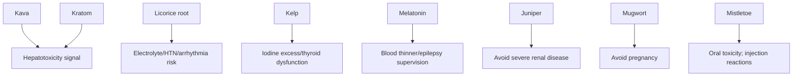

# The Hippie Scientist: Herb detail research shard (J-K-L-M)

## Executive summary

This shard covers 14 common, clinically relevant herb/ingredient records whose slug/name begins with **J, K, L, or M**, selected because they appear in Tier 1 sources (and supported by Tier 2 where relevant). Primary evidence was extracted from entity["organization","NCCIH","nih complementary health"] consumer fact sheets, entity["organization","NIH Office of Dietary Supplements","ods dietary supplement facts"] fact sheets, entity["organization","European Medicines Agency","eu medicines regulator"] herbal monographs/assessment reports, entity["organization","LiverTox","nih liver injury database"] (for hepatotoxicity signals), entity["organization","U.S. Food and Drug Administration","federal food drug agency"] regulatory statements, and Kew’s entity["organization","Plants of the World Online","kew powo plant database"] for accepted names and native range. citeturn12search13turn15search6turn35view0turn35view3turn23view0turn26view0turn19search4turn19search1turn20search0turn21search0turn22search0

**Assumption about “herbs” vs “compounds”:** This index is “herb/compound.” For **melatonin**, **magnesium**, and **L-tryptophan**, the required “Scientific name” field is treated as **not applicable to botany** (non-botanical ingredients); values are left explicit rather than forced into plant taxonomy. citeturn35view0turn35view3turn14search0

**High-signal safety themes (Tier-1-supported):**
- **Kratom**: addiction/withdrawal potential; rare but serious harms (incl. seizures, liver problems) and unresolved drug-interaction risk; FDA states it is **not lawfully marketed** in the U.S. as a drug, dietary supplement, or food additive. citeturn19search3turn19search1  
- **Kava**: rare but sometimes severe **liver injury** (including serious cases), plus sedation risk when combined with other sedatives/alcohol. citeturn33view0turn18search0  
- **Licorice root (glycyrrhizin-containing)**: well-characterized risk of water retention, hypokalemia, hypertension, and arrhythmias; clinically meaningful interaction cautions (diuretics, cardiac glycosides, corticosteroids). citeturn28view0turn11view0  
- **Kelp/iodine**: kelp supplements are iodine sources; evidence of **high iodine content variability** and case reports of iodine-induced thyroid dysfunction; ODS notes some iodine-only supplements exceed the UL. citeturn16view0turn17search0turn17search4  
- **European mistletoe**: oral ingestion of berries/leaves can cause serious harmful effects; injected extracts are used in Europe, but it is not proven as a cancer treatment and is not FDA-approved for cancer. citeturn35view2

### Shard overview table

| Slug | Type | Overall confidence | Strongest Tier‑1 strengths | Most caution-worthy signals |
|---|---|---|---|---|
| juniper | botanical | Medium | EMA monograph + assessment; clear posology; clear renal warnings | Avoid in severe renal disease; pregnancy/lactation not recommended |
| kava | botanical | Medium | NCCIH + LiverTox liver-injury signal | Rare severe hepatotoxicity; sedation/alcohol combo risk |
| kratom | botanical | Medium | NCCIH + FDA regulatory clarity | Dependence/withdrawal; severe adverse events; interaction uncertainty |
| kelp | botanical group | Medium | ODS iodine + PubMed evidence on variability/case reports | Thyroid dysfunction risk from iodine excess/variability |
| lavender | botanical | Medium | NCCIH + EMA posology for lavender oil | Sedation/impair driving; topical allergy reports |
| lemon-balm | botanical | Medium | EMA monograph + detailed assessment (constituents, nonclinical mechanisms) | Potential thyroid-signaling effects are nonclinical/uncertain |
| licorice-root | botanical | High | NCCIH + EMA: strong safety + interaction detail | Electrolyte/HTN/arrhythmia risk; interaction cautions |
| l-tryptophan | compound | Medium | NCCIH guidance + PubMed EMS association | Historical EMS association; limited insomnia efficacy |
| maca | botanical | Low | POWO identity/range; PubMed reviews exist | Evidence heterogeneity; weak dosing/interaction data |
| magnesium | compound | High | ODS: RDAs/UL + interactions + toxicity profile | Diarrhea/toxicity at high doses; renal impairment risk; drug absorption interactions |
| melatonin | compound | High | NCCIH: mechanism, benefit areas, interaction cautions, label-accuracy issues | Blood thinners/epilepsy supervision; labeling/contaminant variability |
| milk-thistle | botanical | Medium | NCCIH + EMA posology; safety/quality cautions | Quality/contamination issues; efficacy mixed in humans |
| mugwort | botanical | Low | NCCIH clear “insufficient evidence”; POWO range | Pregnancy avoidance; overall safety unknown |
| mistletoe | botanical | Medium | NCCIH clinical-quality caution + toxicity statement | Oral toxicity; injection reactions; evidence quality concerns |

*(Table values are derived from the monographs/fact sheets cited within each record below.)* citeturn23view0turn25view0turn33view0turn18search0turn19search3turn19search1turn16view0turn29view0turn30view0turn28view0turn14search0turn22search0turn37view2turn36view1turn27view0turn35view1turn35view2

## juniper

Name: Juniper (juniper cone berry)  
Scientific name: *Juniperus communis* L., galbulus (pseudo-fructus) citeturn23view0turn25view0  
Overall confidence: Medium

### Recommended field updates
- summary: Traditional herbal medicinal product (EU) used to increase urine output for flushing the urinary tract in minor urinary tract complaints; also used for symptomatic relief of digestive disorders (e.g., dyspepsia/flatulence). Evidence basis is long-standing/traditional use. citeturn23view0
- description: Dried ripe “cone berry” of *J. communis* containing essential oil (Ph. Eur. specification described in the EMA assessment report); adulteration can occur with fruits of other *Juniperus* species. citeturn25view0turn23view0
- mechanism: **Proposed mechanism:** diuretic/aquaretic effects are discussed primarily from nonclinical (animal) and methodological-variable studies; evidence in humans is not established in the EMA documentation as “well-established use.” citeturn25view0turn23view0
- safetyNotes: Not recommended in severe renal disease including infectious interstitial nephritis, pyelitis, pyelonephritis; adequate fluid intake is required during treatment for urinary flushing indication; pregnancy/lactation not recommended due to insufficient data; adults-only (under 18 not recommended). citeturn23view0
- interactions: EMA monograph: “none reported.” EMA assessment report notes a **single case report (conference abstract)** of decreased INR in a patient on phenprocoumon during intake of juniper cone berries—clinical significance uncertain. citeturn23view0turn25view0
- activeCompounds: Essential oil constituents (Ph. Eur. requirement ranges referenced in EMA assessment): α-pinene, sabinene, β-pinene, β-myrcene, limonene, terpinen-4-ol, bornyl acetate, β-caryophyllene (among others). citeturn25view0
- dosage: EMA posology (adults/elderly): infusion 2.0–2.5 g in 150 mL boiling water, 1–3×/day (urinary flushing) or 1–4×/day (digestive); liquid extract (1:1) 2–4 mL 3×/day; tincture (1:5) 1–2 mL 3×/day; soft extract 0.57 g once daily (per monograph preparations). citeturn23view0
- preparation: Comminuted cone berry as herbal tea/infusion; liquid extract (DER 1:1, ethanol 25%); tincture (1:5, ethanol 45%); soft extract (water). citeturn23view0
- region: Native range: subarctic and temperate Northern Hemisphere (POWO). citeturn20search0

### Evidence notes
- What is strongly supported: Taxonomy/identity, EU traditional indications, posology/preparations, and renal/pregnancy precautions in EMA monograph; essential oil constituent ranges in EMA assessment report; native range in POWO. citeturn23view0turn25view0turn20search0
- What is only tentative/proposed: Mechanistic “diuretic” explanation (largely nonclinical); phenprocoumon INR case report is low-strength (abstract-level) evidence. citeturn25view0
- What remains unresolved: Robust human efficacy for urinary/digestive endpoints; clinically confirmed interaction profile beyond “none reported” in monograph. citeturn23view0turn25view0

### Sources used
- European Union herbal monograph on *Juniperus communis* L., galbulus (pseudo-fructus) (Final, 2023) - https://www.ema.europa.eu/en/documents/herbal-monograph/final-european-union-herbal-monograph-juniperus-communis-l-pseudo-fructus-galbulus-revision-1_en.pdf  
- EMA assessment report on *Juniperus communis* L., galbulus (pseudo-fructus) (Final, 2023) - https://www.ema.europa.eu/en/documents/herbal-report/final-assessment-report-juniperus-communis-l-pseudo-fructus-galbulus-revision-1_en.pdf  
- POWO: *Juniperus communis* L. - https://powo.science.kew.org/taxon/urn:lsid:ipni.org:names:30088655-2  

### Field confidence
- summary: High  
- description: High  
- mechanism: Medium  
- safetyNotes: High  
- interactions: Medium  
- activeCompounds: High  
- dosage: High  
- preparation: High  
- region: High  

## kava

Name: Kava  
Scientific name: *Piper methysticum* G.Forst. citeturn33view0turn20search1  
Overall confidence: Medium

### Recommended field updates
- summary: Kava is a South Pacific plant used traditionally as a beverage; marketed as a dietary supplement for anxiety. NCCIH notes kava may help anxiety in some contexts but is **not** shown helpful for generalized anxiety disorder symptoms; it has been linked to rare but sometimes severe liver injury. citeturn33view0
- description: Traditionally prepared as a beverage; U.S. products sold as supplements, while some countries regulate as drugs/herbal medicines. POWO lists native range Santa Cruz Islands to Vanuatu. citeturn33view0turn20search1
- mechanism: **Proposed mechanism:** anxiolytic/sedative effects are consistent with observed clinical/anecdotal outcomes, but NCCIH does not claim a definitive molecular mechanism; in vitro evidence shows kava extract can inhibit human cytochrome P450 activities, supporting a plausible interaction pathway. citeturn33view0turn18search2
- safetyNotes: Rare liver injury cases (some severe/fatal) reported with various kava products, including non-aqueous extracts and also some water-prepared beverages; other adverse effects include GI upset, headache, dizziness; long-term high-dose use can cause “kava dermopathy.” Avoid combining with other sedatives (e.g., benzodiazepines) or alcohol. Pregnancy/breastfeeding caution noted by NCCIH. citeturn33view0turn18search0
- interactions: Avoid co-use with sedatives and alcohol (sedation risk); in vitro CYP inhibition suggests potential for drug interactions, but well-designed clinical interaction studies are limited. citeturn33view0turn18search2
- activeCompounds: Kava exposure is commonly expressed as kavalactones/kavapyrones (e.g., “kavapyrone” dosing appears in LiverTox case summaries), but specific constituent lists are product-dependent and not standardized in NCCIH materials. citeturn18search3turn33view0
- dosage: Unresolved for “typical dose” due to product heterogeneity and safety concerns; LiverTox case material includes examples of kava exposure quantified as daily kavapyrones/kavalactones (not a recommended dose). citeturn18search3turn18search0
- preparation: Traditional aqueous beverages; supplement products and extracts (including alcohol/acetone extracts referenced historically in hepatotoxicity investigations). citeturn33view0
- region: Native range (POWO): Santa Cruz Islands to Vanuatu. citeturn20search1

### Evidence notes
- What is strongly supported: Identity/native range; anxiety research exists but is mixed/limited; sedation precautions; rare but serious hepatotoxicity signal in NCCIH + LiverTox. citeturn33view0turn18search0turn20search1
- What is only tentative/proposed: Specific pharmacologic pathway; CYP inhibition is supported in vitro but does not automatically predict clinically important interactions in all contexts. citeturn18search2
- What remains unresolved: A robust, product-specific dose-response relationship (efficacy and hepatotoxicity); validated interaction magnitude in humans for common co-medications. citeturn33view0turn18search0

### Sources used
- Kava: Usefulness and Safety (NCCIH) - https://www.nccih.nih.gov/health/kava  
- Kava Kava (LiverTox, NCBI Bookshelf) - https://www.ncbi.nlm.nih.gov/books/NBK548637/  
- Inhibition of human cytochrome P450 activities by kava extract and kavalactones (PubMed) - https://pubmed.ncbi.nlm.nih.gov/12386118/  
- POWO: *Piper methysticum* G.Forst. - https://powo.science.kew.org/taxon/urn:lsid:ipni.org:names:198437-2  

### Field confidence
- summary: High  
- description: High  
- mechanism: Medium  
- safetyNotes: High  
- interactions: Medium  
- activeCompounds: Medium  
- dosage: Low  
- preparation: Medium  
- region: High  

## kratom

Name: Kratom  
Scientific name: *Mitragyna speciosa* Korth. citeturn19search3turn20search2  
Overall confidence: Medium

### Recommended field updates
- summary: Research is early; NCCIH notes major knowledge gaps about short- and long-term effects and safety. Reported uses include attempts to manage opioid withdrawal, but kratom can be addictive with withdrawal symptoms; adverse effects range from nausea/constipation/drowsiness to rare serious effects (seizures, high blood pressure, liver problems). citeturn19search3
- description: A tropical tree; POWO reports native range from S. Indo-China to New Guinea. In the U.S., products have been marketed as “dietary supplements,” but legality is contested by FDA statements. citeturn20search2turn19search1
- mechanism: **Proposed mechanism:** kratom contains indole/oxindole alkaloids; mitragynine is described as a major alkaloid and is metabolized to 7-hydroxymitragynine, which is more potent at μ-opioid receptor activity in mechanistic discussions; human evidence remains limited. citeturn19search6turn19search3
- safetyNotes: Potential for dependence/withdrawal; reported serious adverse events include seizures and liver problems; deaths appear linked mainly to use in combination with other drugs; liver injury cases have been reported in structured case series. citeturn19search3turn19search8turn19search0
- interactions: NCCIH flags that kratom may interact with many medications and that more research is needed on drug interactions; NCCIH also notes combination with other drugs has been linked to severe adverse effects/deaths. citeturn19search7turn19search3
- activeCompounds: Mitragynine; 7-hydroxymitragynine (7‑OH) (alkaloids discussed in mechanistic literature and noted in FDA enforcement focus). citeturn19search6turn19search9
- dosage: Unresolved—no established safe/effective dosing standard in Tier‑1 sources; NCCIH emphasizes early research stage and variability/uncertainty. citeturn19search3
- preparation: Unresolved in Tier‑1/2 sources for standardized forms/DER; product forms vary (not reliably standardized across market). citeturn19search3turn19search1
- region: Native range (POWO): S. Indo-China to New Guinea. citeturn20search2

### Evidence notes
- What is strongly supported: Taxonomy/native range; safety “signal” characterization (dependence potential; reported serious events); FDA position on unlawful marketing status; presence of liver injury cases in case series and LiverTox. citeturn20search2turn19search3turn19search1turn19search8turn19search0
- What is only tentative/proposed: Specific receptor pharmacology as a stand-in for expected clinical effects; broad interaction warnings lack precise co-medication quantification. citeturn19search6turn19search7
- What remains unresolved: Any clinically “safe” dose range; validated therapeutic indications; standardized preparation/quality benchmarks tied to safety outcomes. citeturn19search3turn19search1

### Sources used
- Kratom (NCCIH) - https://www.nccih.nih.gov/health/kratom  
- FDA and Kratom (FDA) - https://www.fda.gov/news-events/public-health-focus/fda-and-kratom  
- Kratom (LiverTox, NCBI Bookshelf) - https://www.ncbi.nlm.nih.gov/books/NBK548231/  
- Liver Injury Associated with Kratom (PMC) - https://pmc.ncbi.nlm.nih.gov/articles/PMC8113016/  
- POWO: *Mitragyna speciosa* Korth. - https://powo.science.kew.org/taxon/urn:lsid:ipni.org:names:756303-1  
- FDA warning letters re: 7-hydroxymitragynine products (FDA) - https://www.fda.gov/news-events/press-announcements/fda-issues-warning-letters-firms-marketing-products-containing-7-hydroxymitragynine  

### Field confidence
- summary: High  
- description: Medium  
- mechanism: Medium  
- safetyNotes: High  
- interactions: Medium  
- activeCompounds: Medium  
- dosage: Low  
- preparation: Low  
- region: High  

## kelp

Name: Kelp (iodine-containing seaweed products)  
Scientific name: Unresolved—“kelp” is a common-name category covering multiple brown algae species used in commerce; Tier‑1 sources discuss kelp supplements without specifying a single botanical taxon. citeturn16view0turn17search0  
Overall confidence: Medium

### Recommended field updates
- summary: Kelp supplements are used primarily as **iodine sources**; ODS notes iodine in supplements is often potassium iodide/sodium iodide and that supplements containing kelp (seaweed) are also available. citeturn16view0
- description: Commercial seaweed/kelp foods and supplements show wide measured iodine content ranges in analytical studies, indicating variability across product types and species. citeturn17search0
- mechanism: **Proposed mechanism:** iodine supports thyroid hormone synthesis; excessive iodine intake from kelp/seaweed can precipitate thyroid dysfunction in susceptible individuals (supported by case reports of iodine-induced thyrotoxicosis from kelp-containing intake). citeturn16view0turn17search4
- safetyNotes: ODS notes iodine-only supplements may contain high doses, sometimes above the UL, and kelp supplements are among available iodine sources; clinical literature includes case reports linking kelp-containing consumption to iodine-induced thyrotoxicosis. citeturn16view0turn17search4
- interactions: Unresolved for kelp-specific interactions. (Interaction evidence is clearer for pharmacologic iodine salts; kelp products are composition-variable and not standardized in the Tier‑1 sources reviewed.) citeturn16view0turn17search0
- activeCompounds: Iodine (primary dietarily relevant constituent); measured iodine content varies substantially across macroalgae-containing products. citeturn16view0turn17search0
- dosage: **Iodine guidance (not kelp mass):** ODS notes that many multivitamin/mineral supplements contain iodine often at 150 mcg, and some iodine-only supplements contain high doses (sometimes above the UL). A kelp “mg/day” dose is not reliable due to iodine variability. citeturn16view0
- preparation: Often sold as dietary supplements containing kelp as an iodine source; product composition is not standardized in Tier‑1 sources. citeturn16view0turn17search0
- region: Unresolved—depends on species used and sourcing; not defined in Tier‑1 sources for the generic “kelp supplement” category. citeturn16view0

### Evidence notes
- What is strongly supported: Kelp supplements exist as iodine sources; iodine supplement dosing variability and “above UL” risk is acknowledged by ODS; measured iodine variability in commercial products is supported by analytical studies; thyroid dysfunction case reports exist. citeturn16view0turn17search0turn17search4
- What is only tentative/proposed: Generalized kelp-to-thyroid-risk mapping for all users; risk is plausibly higher in susceptible groups but not uniformly quantified across products/species. citeturn17search0turn17search4
- What remains unresolved: A single scientific name; a safe kelp mass-based dosing guideline; kelp-specific, reproducible interaction list. citeturn16view0turn17search0

### Sources used
- Iodine – Health Professional Fact Sheet (ODS/NIH) - https://ods.od.nih.gov/factsheets/Iodine-HealthProfessional/  
- Commercially available kelp and seaweed products (PMC) - https://pmc.ncbi.nlm.nih.gov/articles/PMC8035890/  
- Iodine-Induced Thyrotoxicosis After Ingestion of Kelp-Containing Tea (PMC) - https://pmc.ncbi.nlm.nih.gov/articles/PMC1924637/  
- Iodine supplementation of pregnant women in Europe (PubMed; notes seaweed variability) - https://pubmed.ncbi.nlm.nih.gov/15220938/  

### Field confidence
- summary: Medium  
- description: Medium  
- mechanism: Medium  
- safetyNotes: Medium  
- interactions: Low  
- activeCompounds: Medium  
- dosage: Medium  
- preparation: Low  
- region: Low  

## lavender

Name: Lavender  
Scientific name: *Lavandula angustifolia* Mill. citeturn29view0turn20search11  
Overall confidence: Medium

### Recommended field updates
- summary: Lavender is promoted for anxiety/stress and other conditions; NCCIH notes an oral lavender oil product may be beneficial for anxiety in some studies, but limitations include small samples, limited independent replication, and participant diversity concerns; aromatherapy evidence for anxiety/sleep is unclear. citeturn29view0
- description: Aromatic plant native to the Mediterranean region; promoted for oral supplement use, aromatherapy, and topical use. POWO lists native range in parts of southern Europe (NE Spain to Italy). citeturn29view0turn20search11
- mechanism: **Proposed mechanism:** not established as a definitive clinical mechanism in Tier‑1 sources; EMA monograph frames use as traditional for mild mental stress/exhaustion and to aid sleep (consistent with sedative effects) without requiring pharmacodynamic proof for traditional registration. citeturn29view1
- safetyNotes: Food-level use likely safe; short-term oral products might be safe in studied doses but can cause GI symptoms (diarrhea, headache, nausea, burping); aromatherapy is “possibly safe” but may cause headache/coughing; topical products may cause allergic skin reactions; rare reports of breast tissue swelling in children with topical lavender products—causality unclear. EMA notes driving/machinery impairment potential and advises against use in pregnancy/lactation due to insufficient data. citeturn29view0turn29view1
- interactions: EMA: none reported. NCCIH recommends clinician discussion for supplement-drug interactions generally; no specific lavender interactions are established in the Tier‑1 sources reviewed. citeturn29view1turn29view0
- activeCompounds: Unresolved at compound-specific level in Tier‑1 sources used here (EMA monograph defines “lavender oil” as steam-distilled essential oil but does not enumerate major constituents in the monograph text). citeturn29view1
- dosage: EMA (lavender oil): oral daily dose 20–80 mg; bath additive 1–3 g per full bath once daily; avoid in children under 12. citeturn29view1
- preparation: Essential oil obtained by steam distillation from flowering tops; used orally (liquid dosage form) and as bath additive. citeturn29view1
- region: Native Mediterranean range; POWO: NE Spain to Italy. citeturn29view0turn20search11

### Evidence notes
- What is strongly supported: Identity; traditional-use framing and posology for lavender oil in EMA; NCCIH safety points; region in POWO. citeturn29view1turn29view0turn20search11
- What is only tentative/proposed: Efficacy for anxiety and depression symptoms outside a specific product context; aromatherapy benefits remain unclear. citeturn29view0
- What remains unresolved: High-confidence “activeCompounds” list from Tier‑1 sources for lavender oil; robust, independent multicenter evidence across diverse populations. citeturn29view0turn29view1

### Sources used
- Lavender: Usefulness and Safety (NCCIH) - https://www.nccih.nih.gov/health/lavender  
- Community herbal monograph on *Lavandula angustifolia* Miller, aetheroleum (EMA) - https://www.ema.europa.eu/en/documents/herbal-monograph/final-community-herbal-monograph-lavandula-angustifolia-miller-aetheroleum_en.pdf  
- POWO: *Lavandula angustifolia* Mill. - https://powo.science.kew.org/taxon/urn:lsid:ipni.org:names:449008-1  

### Field confidence
- summary: Medium  
- description: High  
- mechanism: Low  
- safetyNotes: Medium  
- interactions: Low  
- activeCompounds: Low  
- dosage: High  
- preparation: High  
- region: High  

## lemon-balm

Name: Lemon balm (Melissa leaf)  
Scientific name: *Melissa officinalis* L., folium citeturn30view0turn21search0  
Overall confidence: Medium

### Recommended field updates
- summary: Traditional herbal medicinal product (EU) for relief of mild mental stress and to aid sleep; also for symptomatic treatment of mild GI complaints (bloating/flatulence), based on long-standing use. citeturn30view0
- description: EMA assessment report lists key constituent categories: essential oil (with monoterpene aldehydes such as citral/neral/citronellal), flavonoids, phenylpropanoids (notably rosmarinic acid, with Ph. Eur. minimum content), tannins, and triterpenes. citeturn32view2
- mechanism: **Proposed mechanism:** nonclinical data include (a) inhibition of GABA transaminase in vitro with increased GABA levels, (b) CNS receptor binding activity in human brain-membrane assays (in vitro), and (c) sedative/anxiolytic-like effects in animal models; additionally, water extract may inhibit thyroid stimulating hormone activity in vitro/animals, with **unknown clinical relevance**. citeturn32view0turn30view0turn32view3
- safetyNotes: EMA monograph: pregnancy/lactation not recommended (insufficient data); may impair ability to drive/use machines. citeturn30view0
- interactions: EMA monograph: “no data available” on interactions (not the same as “none”). citeturn30view0
- activeCompounds: Essential oil constituents (citral/neral/citronellal), rosmarinic acid (phenylpropanoid), flavonoids (luteolin/quercetin/apigenin/kaempferol glycosides), triterpenes (ursolic/oleanolic acids) as listed in EMA assessment report. citeturn32view2
- dosage: EMA monograph (≥12 years): tea 1.5–4.5 g in 150 mL boiling water, 1–3×/day; powder 0.19–0.55 g 2–3×/day; liquid extract 2–4 mL 1–3×/day; tincture 2–6 mL 1–3×/day. citeturn30view0
- preparation: Comminuted herbal substance (tea), powdered herb, liquid extract (DER 1:1; ethanol 45–53% v/v), tincture (1:5; ethanol 45–53% v/v), dried extracts corresponding to these preparations. citeturn30view0
- region: Native range (POWO): Mediterranean to Central Asia. citeturn21search0

### Evidence notes
- What is strongly supported: EU traditional indications and posology; constituent categories and rosmarinic-acid standardization requirement in EMA assessment report; native range in POWO. citeturn30view0turn32view2turn21search0
- What is only tentative/proposed: GABAergic/CNS receptor binding mechanisms and thyroid activity inhibition are largely **in vitro/animal**; clinical relevance uncertain. citeturn32view0turn32view3
- What remains unresolved: Clinically confirmed interaction profile; high-quality human trials linking constituent markers to outcomes across different preparations. citeturn30view0turn31view0

### Sources used
- Community herbal monograph on *Melissa officinalis* L., folium (EMA) - https://www.ema.europa.eu/en/documents/herbal-monograph/final-community-herbal-monograph-melissa-officinalis-l-folium_en.pdf  
- EMA assessment report on *Melissa officinalis* L., folium - https://www.ema.europa.eu/en/documents/herbal-report/final-assessment-report-melissa-officinalis-l-folium_en.pdf  
- POWO: *Melissa officinalis* L. - https://powo.science.kew.org/taxon/urn:lsid:ipni.org:names:450084-1  

### Field confidence
- summary: High  
- description: High  
- mechanism: Medium  
- safetyNotes: Medium  
- interactions: Medium  
- activeCompounds: High  
- dosage: High  
- preparation: High  
- region: High  

## licorice-root

Name: Licorice root  
Scientific name: *Glycyrrhiza glabra* L.; *Glycyrrhiza uralensis* Fisch. ex DC.; *Glycyrrhiza inflata* Bat. (as used in EMA/NCCIH scope) citeturn28view0turn11view0  
Overall confidence: High

### Recommended field updates
- summary: Traditional herbal medicinal product (EU): relief of digestive symptoms including burning sensation/dyspepsia and as an expectorant for cough associated with cold; traditional-use basis. citeturn11view0
- description: Perennial herb cultivated widely; many U.S. “licorice” products may not contain true licorice; licorice contains glycyrrhizin/glycyrrhizic acid associated with serious adverse effects at higher or prolonged intakes. citeturn28view0
- mechanism: **Proposed mechanism (for major safety effects):** glycyrrhizin-containing licorice can lead to water retention, hypokalemia, hypertension, and cardiac rhythm disorders—effects repeatedly emphasized in EMA monograph safety warnings and NCCIH safety summary. citeturn11view0turn28view0
- safetyNotes: EMA warns not to take other licorice-containing products concurrently; serious adverse events can occur (water retention, hypokalemia, hypertension, rhythm disorders). Not recommended in patients with hypertension, kidney disease, liver/cardiovascular disorders, or hypokalemia. Duration: not to be used >4 weeks. NCCIH notes glycyrrhizin can cause serious effects including irregular heartbeat/cardiac arrest; DGL products may be safe up to ~4 months (short-term). Pregnancy: NCCIH flags high intake as unsafe and associated with earlier delivery risk; EMA does not recommend use in pregnancy/lactation due to insufficient data. citeturn11view0turn28view0
- interactions: EMA: may counteract antihypertensive medications; not to be used with diuretics, cardiac glycosides, corticosteroids, stimulant laxatives, or other meds aggravating electrolyte imbalance. NCCIH notes interactions with corticosteroids have been reported. citeturn11view0turn28view0
- activeCompounds: Glycyrrhizin / glycyrrhizic acid (explicitly named by NCCIH as the component associated with serious adverse effects). citeturn28view0
- dosage: EMA posology (adults/elderly):  
  - Digestive indication: tea 1.5–2 g in 150 mL boiling water (infusion) 2–4×/day or decoction 2–4×/day; soft extract (DER 1:0.4–0.5) 32 mg 2–3×/day (max 160 mg/day).  
  - Cough/cold indication: tea 1.5 g in 150 mL 2×/day (infusion or decoction); soft extract (DER 3:1) 1.2–1.5 g 3–4×/day.  
  Duration limits and age restrictions apply (under 18 not recommended). citeturn11view0
- preparation: Comminuted root as herbal tea (infusion/decoction); soft extracts and corresponding dry extracts; oral use. citeturn11view0
- region: *Glycyrrhiza glabra* native range (POWO): Central Mediterranean to Mongolia and Pakistan; cultivated/introduced elsewhere (NCCIH characterizes cultivation throughout Europe, Asia, Middle East). citeturn21search5turn28view0

### Evidence notes
- What is strongly supported: Safety and interaction cautions (EMA + NCCIH); traditional-use indications and detailed posology (EMA); identity scope (three Glycyrrhiza spp.). citeturn11view0turn28view0
- What is only tentative/proposed: Efficacy for many promoted uses beyond monograph indications (NCCIH states insufficient high-quality evidence for any single condition). citeturn28view0
- What remains unresolved: Product-by-product glycyrrhizin content and threshold for harm; robust dosing guidance for non-traditional indications. citeturn28view0turn11view0

### Sources used
- Licorice Root: Usefulness and Safety (NCCIH) - https://www.nccih.nih.gov/health/licorice-root  
- Community herbal monograph on *Glycyrrhiza glabra/inflata/uralensis*, radix (EMA) - https://www.ema.europa.eu/en/documents/herbal-monograph/final-community-herbal-monograph-glycyrrhiza-glabra-l-andor-glycyrrhiza-inflata-bat-andor-glycyrrhiza-uralensis-fisch-radix-first-version_en.pdf  
- POWO: *Glycyrrhiza glabra* L. - https://powo.science.kew.org/taxon/urn:lsid:ipni.org:names:496941-1  

### Field confidence
- summary: High  
- description: High  
- mechanism: High  
- safetyNotes: High  
- interactions: High  
- activeCompounds: High  
- dosage: High  
- preparation: High  
- region: Medium  

## l-tryptophan

Name: L-tryptophan  
Scientific name: Not applicable (non-botanical supplement ingredient; essential amino acid) citeturn14search0turn14search7  
Overall confidence: Medium

### Recommended field updates
- summary: L-tryptophan is used in supplements (sometimes as a sleep aid/precursor to melatonin), but NCCIH notes **very limited data** for insomnia and cites clinical practice guidelines recommending against tryptophan for chronic insomnia due to insufficient evidence. L-tryptophan ingestion was associated with the 1989 eosinophilia-myalgia syndrome (EMS) epidemic in published medical literature. citeturn14search0turn14search7
- description: NCCIH describes L-tryptophan (and 5-HTP) as substances that can be converted into melatonin and having sedative effects, with unclear mechanism and limited insomnia data. citeturn14search0
- mechanism: **Proposed mechanism:** precursor pathway to melatonin (and likely other biogenic amines) is referenced by NCCIH in the sleep-disorders context; sedative effects noted, but mechanism and clinical effect size remain unclear. citeturn14search0
- safetyNotes: EMS was associated with ingestion of L-tryptophan in published reviews; this is a major historical safety signal relevant to supplement quality/contamination risk. citeturn14search7turn14search13
- interactions: Unresolved in Tier‑1 sources reviewed here (no specific, high-confidence interaction list provided in NCCIH sleep-disorders content). citeturn14search0
- activeCompounds: L-tryptophan (single-ingredient record). citeturn14search7
- dosage: Unresolved—guidelines recommended against its use for chronic insomnia; no authoritative dosing standard extracted from Tier‑1 sources in this shard. citeturn14search0
- preparation: Oral dietary supplement ingredient; formulations vary. citeturn14search0
- region: Not applicable (nutrient/amino acid present broadly in foods; not a single regional botanical). citeturn14search7

### Evidence notes
- What is strongly supported: Guideline “recommend against” statement for chronic insomnia in NCCIH sleep-disorders overview; published association of EMS with L-tryptophan ingestion. citeturn14search0turn14search7turn14search13
- What is only tentative/proposed: Specific mechanistic explanations beyond “precursor to melatonin” and “sedative effects.” citeturn14search0
- What remains unresolved: Current supplement-market risk profiling (product testing) and any safe/effective dosing for insomnia. citeturn14search0

### Sources used
- Sleep Disorders and Complementary Health Approaches (NCCIH) - https://www.nccih.nih.gov/health/sleep-disorders-and-complementary-health-approaches  
- L-tryptophan and the eosinophilia-myalgia syndrome (PubMed) - https://pubmed.ncbi.nlm.nih.gov/8423409/  
- Post-epidemic eosinophilia-myalgia syndrome associated with L-tryptophan (PubMed) - https://pubmed.ncbi.nlm.nih.gov/21702023/  

### Field confidence
- summary: Medium  
- description: Medium  
- mechanism: Low  
- safetyNotes: Medium  
- interactions: Low  
- activeCompounds: High  
- dosage: Low  
- preparation: Low  
- region: Low  

## maca

Name: Maca  
Scientific name: *Lepidium meyenii* Walp. (POWO lists *Lepidium peruvianum* as a synonym) citeturn22search0turn22search1  
Overall confidence: Low

### Recommended field updates
- summary: Contemporary clinical literature summarized in recent reviews suggests maca research in humans is primarily focused on sexual health endpoints, and reports potential improvements in sexual desire and related outcomes; broader claimed benefits are not firmly established and require cautious interpretation. citeturn13search1turn22search5
- description: High-altitude Andean plant used as a nutrient-dense food and marketed as a supplement; POWO lists native range S. Peru to NW Argentina. citeturn22search0turn22search5
- mechanism: **Proposed mechanism:** not clearly established in Tier‑1 sources reviewed here; reviews discuss multiple hypothesized pathways and phytochemical categories, but clinical linkage remains uncertain. citeturn13search1turn22search5
- safetyNotes: Unresolved in Tier‑1 sources used in this shard (no NCCIH/ODS/EMA monograph extracted here; PubMed reviews exist but require more targeted extraction to separate known harms from theoretical concerns).
- interactions: Unresolved—no Tier‑1 interaction monograph/fact sheet extracted here.
- activeCompounds: Unresolved—PubMed reviews discuss phytochemistry, but compound lists are not extracted here to avoid overreach without targeted confirmation.
- dosage: Unresolved—no EMA monograph/ODS fact sheet dosing standard extracted here; clinical trial protocols exist but are study-specific and not a general recommendation. citeturn13search4
- preparation: Unresolved in Tier‑1/2 sources used here; (commonly sold as powdered root/hypocotyl and extracts, but not extracted without direct Tier‑1 text confirmation in this shard).
- region: Native range (POWO): S. Peru to NW Argentina. citeturn22search0

### Evidence notes
- What is strongly supported: Taxonomic identity and synonymy in POWO; geographic native range. citeturn22search0turn22search1
- What is only tentative/proposed: Many claimed health benefits beyond sexual health (review-level claims with variable underlying study quality). citeturn13search1
- What remains unresolved: Rigorous dosing guidance, interaction profile, and high-confidence active-compound marker set suitable for standardized product evaluation. citeturn13search1turn13search4

### Sources used
- POWO: *Lepidium meyenii* Walp. - https://powo.science.kew.org/taxon/urn:lsid:ipni.org:names:286286-1  
- POWO: *Lepidium peruvianum* (synonym note) - https://powo.science.kew.org/taxon/urn:lsid:ipni.org:names:60450131-2  
- A comprehensive review of the effects of maca (PMC, 2024) - https://pmc.ncbi.nlm.nih.gov/articles/PMC10910417/  
- Not All Maca Is Created Equal (PMC, 2024) - https://pmc.ncbi.nlm.nih.gov/articles/PMC10892513/  
- ClinicalTrials.gov: Maca Root study (NCT00568126) - https://clinicaltrials.gov/study/NCT00568126  

### Field confidence
- summary: Low  
- description: Medium  
- mechanism: Low  
- safetyNotes: Low  
- interactions: Low  
- activeCompounds: Low  
- dosage: Low  
- preparation: Low  
- region: High  

## magnesium

Name: Magnesium  
Scientific name: Not applicable (mineral nutrient; not botanical) citeturn35view3turn37view2  
Overall confidence: High

### Recommended field updates
- summary: Magnesium is an essential mineral and cofactor in more than 300 enzyme systems, used in many dietary supplements and present in some medicines (e.g., antacids/laxatives). citeturn35view3
- description: ODS details physiologic roles (energy production, DNA/RNA synthesis, nerve and muscle function, normal heart rhythm) and notes supplements contain different magnesium salts with differing bioavailability. citeturn35view3turn37view2
- mechanism: **Mechanism (well supported physiologic role):** cofactor roles in biochemical reactions; supports ion transport relevant to nerve impulse conduction, muscle contraction, and heart rhythm. citeturn35view3
- safetyNotes: High supplemental doses can cause diarrhea, nausea, abdominal cramping; very high doses can cause magnesium toxicity (hypotension, vomiting, difficulty breathing, arrhythmia, cardiac arrest), with increased risk in impaired renal function. ODS provides ULs for supplemental magnesium and notes toxicity risk patterns. citeturn37view2
- interactions: Magnesium can decrease absorption of oral bisphosphonates; forms insoluble complexes with tetracycline and quinolone antibiotics (timing separation recommended); diuretics and proton pump inhibitors can affect magnesium status, and FDA reviewed PPI-related hypomagnesemia cases. citeturn37view2
- activeCompounds: Magnesium (elemental magnesium provided via various salts; label expresses elemental magnesium amount). citeturn37view2turn35view3
- dosage: Use ODS RDAs and ULs as the dosing anchor; ODS explicitly states UL for supplemental magnesium is 350 mg/day for adults (from supplements/medications, not food), and provides context-specific dosing ranges in clinical studies (e.g., BP trials) without making supplement recommendations. citeturn37view2
- preparation: Supplements in multiple salt forms; bioavailability differences (e.g., citrate/chloride/aspartate tend to have higher bioavailability than oxide/sulfate). citeturn37view2
- region: Not applicable (nutrient present broadly; not plant-region bound). citeturn35view3

### Evidence notes
- What is strongly supported: Core physiology, toxicity patterns, ULs, and named medication-interaction classes within ODS magnesium fact sheet. citeturn37view2turn35view3
- What is only tentative/proposed: Disease-prevention claims (e.g., cardiovascular outcomes) remain mixed; ODS emphasizes “more research needed” in multiple health sections. citeturn37view2
- What remains unresolved: Individualized dosing beyond RDAs/ULs for specific disease indications without clinician supervision. citeturn37view2

### Sources used
- Magnesium – Health Professional Fact Sheet (ODS) - https://ods.od.nih.gov/factsheets/Magnesium-HealthProfessional/  
- Magnesium – Consumer Fact Sheet (ODS) - https://ods.od.nih.gov/factsheets/Magnesium-Consumer/  
- Magnesium Fact Sheet for Consumers (PDF, ODS) - https://ods.od.nih.gov/pdf/factsheets/magnesium-consumer.pdf  

### Field confidence
- summary: High  
- description: High  
- mechanism: High  
- safetyNotes: High  
- interactions: High  
- activeCompounds: High  
- dosage: High  
- preparation: Medium  
- region: High  

## melatonin

Name: Melatonin  
Scientific name: Not applicable (endogenous hormone; dietary supplement ingredient) citeturn35view0turn36view1  
Overall confidence: High

### Recommended field updates
- summary: Melatonin is a hormone produced in response to darkness; it helps regulate circadian rhythms and sleep timing. Supplements may help jet lag and certain circadian/sleep problems; evidence for chronic insomnia is not strong enough for guideline endorsement in NCCIH summary. citeturn35view0turn36view1
- description: Most melatonin supplements are made synthetically (NCCIH notes supplements can be made from animals or microorganisms but most often synthetic). citeturn35view0
- mechanism: **Mechanism (well supported):** melatonin production is light-sensitive and contributes to circadian rhythm timing; supplementation aims to shift/augment circadian signaling. citeturn35view0
- safetyNotes: Short-term use appears safe for most people; long-term safety unclear. NCCIH flags potential hormonal-development concerns (uncertain), allergic reaction risk, limited pregnancy/lactation research, and older-adult concerns (e.g., dementia guideline recommendation against use). NCCIH also highlights substantial label-accuracy issues in commercial products and reports of serotonin contamination in tested supplements. citeturn36view1turn35view0
- interactions: NCCIH: people taking medicines should consult providers; **especially people with epilepsy and those taking blood thinners**, who “need to be under medical supervision” when taking melatonin supplements. citeturn36view1
- activeCompounds: Melatonin (single-ingredient record). citeturn35view0
- dosage: Unresolved as a single “standard dose” (use is condition-dependent; NCCIH summarizes study-level evidence rather than recommending a universal dose). citeturn35view0turn36view1
- preparation: Oral dietary supplement formulations (tablets/capsules/liquid/gummies referenced as common market forms in NCCIH discussion of labeling and pediatric exposures). citeturn36view1
- region: Not applicable (endogenous hormone; supplements manufactured; not plant-region bound). citeturn35view0

### Evidence notes
- What is strongly supported: Core physiology and circadian role; key safety caveats; explicit interaction cautions (blood thinners/epilepsy); quality/labeling variability concerns. citeturn35view0turn36view1
- What is only tentative/proposed: Long-term endocrine developmental impacts; broad disease-modifying effects outside sleep/circadian context (NCCIH notes “not fully understood”). citeturn35view0
- What remains unresolved: A single dosing standard across indications/populations; reproducible supplement quality without independent verification. citeturn36view1turn35view0

### Sources used
- Melatonin: What You Need To Know (NCCIH) - https://www.nccih.nih.gov/health/melatonin-what-you-need-to-know  
- Sleep Disorders and Complementary Health Approaches (NCCIH; guideline context) - https://www.nccih.nih.gov/health/sleep-disorders-and-complementary-health-approaches  

### Field confidence
- summary: High  
- description: High  
- mechanism: High  
- safetyNotes: High  
- interactions: High  
- activeCompounds: High  
- dosage: Medium  
- preparation: Medium  
- region: High  

## milk-thistle

Name: Milk thistle  
Scientific name: *Silybum marianum* (L.) Gaertn., fructus citeturn27view0turn26view0turn21search2  
Overall confidence: Medium

### Recommended field updates
- summary: Marketing claims commonly target liver disorders and metabolic outcomes; NCCIH states there is insufficient high-quality evidence for definitive conclusions in people, with mixed/limited clinical trial results for liver diseases and some evidence suggesting possible blood sugar effects in type 2 diabetes (with generalizability limitations). EMA monograph frames use as **traditional** for digestive disorders and “support liver function” after serious conditions are excluded by a medical doctor. citeturn27view0turn26view0
- description: NCCIH identifies silymarin (mixture of compounds) as the main constituent of milk thistle extract; EMA monograph specifies multiple preparation types (tea, powdered herb, various dry/soft extracts with DER and solvents). citeturn27view0turn26view0
- mechanism: **Proposed mechanism:** silymarin mixture is the named major constituent (NCCIH); mechanistic pathways are not established as strong clinical mechanisms in EMA traditional-use monograph, and human efficacy remains conflicting/limited. citeturn27view0turn26view0
- safetyNotes: NCCIH: generally well tolerated orally; common side effects are digestive symptoms; allergic reactions possible especially in those allergic to related plants; little is known about safety in pregnancy/breastfeeding. NCCIH raises concerns about poor chemical/microbiological quality and contamination/label mismatch in commercial supplements. EMA monograph lists GI symptoms and allergic reactions as possible undesirable effects and notes Asteraceae allergy contraindication; pregnancy/lactation not recommended due to insufficient data. citeturn27view0turn26view0
- interactions: EMA: none reported. NCCIH advises consulting clinicians because herb–medicine interactions can occur but does not provide a definitive interaction list for milk thistle in the fact sheet. citeturn26view0turn27view0
- activeCompounds: Silymarin (mixture of compounds) as main constituent of extract. citeturn27view0
- dosage: EMA posology (adults/elderly) includes: tea 3–5 g in 100 mL boiling water 2–3×/day; powdered herb 300–600 mg 2–3×/day (daily up to 1800 mg); multiple extract-specific single-dose ranges by DER/solvent. citeturn26view0
- preparation: Tea (comminuted fruit), powdered substance, dry extracts (multiple solvents/DER ranges), soft extract; oral use. citeturn26view0
- region: Native range (POWO): Macaronesia, Mediterranean to Central Asia and India, Ethiopia. citeturn21search2

### Evidence notes
- What is strongly supported: Identity, constituent naming (silymarin), safety profile outline and product-quality concerns (NCCIH), and EMA dose/preparation framework for medicinal products. citeturn27view0turn26view0
- What is only tentative/proposed: Efficacy for specific liver diseases (conflicting trials) and diabetes outcomes; mechanistic claims beyond “silymarin mixture” without product standardization. citeturn27view0
- What remains unresolved: Clear interaction profile in humans; product-quality normalization sufficient to compare clinical results across trials/products. citeturn27view0turn26view0

### Sources used
- Milk Thistle: Usefulness and Safety (NCCIH) - https://www.nccih.nih.gov/health/milk-thistle  
- EU herbal monograph on *Silybum marianum* (L.) Gaertn., fructus (EMA) - https://www.ema.europa.eu/en/documents/herbal-monograph/final-european-union-herbal-monograph-silybum-marianum-l-gaertn-fructus_en.pdf  
- POWO: *Silybum marianum* (L.) Gaertn. - https://powo.science.kew.org/taxon/urn:lsid:ipni.org:names:249211-1  

### Field confidence
- summary: Medium  
- description: High  
- mechanism: Medium  
- safetyNotes: High  
- interactions: Low  
- activeCompounds: Medium  
- dosage: High  
- preparation: High  
- region: High  

## mugwort

Name: Mugwort  
Scientific name: *Artemisia vulgaris* L. citeturn35view1turn21search3  
Overall confidence: Low

### Recommended field updates
- summary: NCCIH states very little human research exists; there is not enough evidence to determine whether mugwort is safe or useful for any health condition. citeturn35view1
- description: Native to Europe and parts of Asia and Africa; now grows widely including North America; used historically in traditional medicines for GI and gynecological problems; currently promoted for multiple oral uses and in topical combination products. POWO lists native range: temperate Eurasia to Indo-China and North Africa. citeturn35view1turn21search3
- mechanism: **Proposed mechanism:** Unresolved—no clinically validated mechanism in Tier‑1 sources; literature includes phytochemical discussions, but clinical relevance is not established. citeturn35view1turn12search3
- safetyNotes: NCCIH: insufficient evidence to know whether oral or topical mugwort is safe; should not be used during pregnancy; breastfeeding safety is unknown. citeturn35view1
- interactions: Unresolved—NCCIH provides general caution about potential herb–medicine interactions but no specific mugwort interaction list. citeturn35view1
- activeCompounds: Unresolved for field-ready markers (Tier‑1 NCCIH page does not specify compounds; additional phytochemistry literature exists but would require a targeted extraction step to avoid overreach). citeturn35view1turn12search3
- dosage: Unresolved (no authoritative dosing guidance extracted in NCCIH/EMA/ODS sources for mugwort in this shard). citeturn35view1
- preparation: Unresolved—NCCIH primarily notes promotional uses and one topical combination product study; does not provide standardized preparation guidance. citeturn35view1
- region: Native range: temperate Eurasia to Indo-China and North Africa (POWO); NCCIH describes native Europe and parts of Asia/Africa with global spread. citeturn21search3turn35view1

### Evidence notes
- What is strongly supported: NCCIH’s “insufficient evidence” and pregnancy avoidance; identity and region from POWO. citeturn35view1turn21search3
- What is only tentative/proposed: Any mechanistic or therapeutic claims beyond the single preliminary topical combination product report. citeturn35view1
- What remains unresolved: Active-compound markers, dosing, and interaction specifics suitable for structured use. citeturn35view1

### Sources used
- Mugwort: Usefulness and Safety (NCCIH) - https://www.nccih.nih.gov/health/mugwort  
- POWO: *Artemisia vulgaris* L. - https://powo.science.kew.org/taxon/urn:lsid:ipni.org:names:20812-2  
- Significance of *Artemisia vulgaris* (Common Mugwort) in the History of Medicine (PMC, 2020) - https://pmc.ncbi.nlm.nih.gov/articles/PMC7583039/  

### Field confidence
- summary: High  
- description: Medium  
- mechanism: Low  
- safetyNotes: Medium  
- interactions: Low  
- activeCompounds: Low  
- dosage: Low  
- preparation: Low  
- region: High  

## mistletoe

Name: European mistletoe  
Scientific name: *Viscum album* L. citeturn35view2  
Overall confidence: Medium

### Recommended field updates
- summary: European mistletoe has been promoted as a cancer treatment; NCCIH states it is **not a proven cancer treatment** and should not be used as cancer treatment outside clinical trials. Most research involves injected extracts; very little research evaluates oral use. citeturn35view2
- description: Semiparasitic plant growing on multiple host trees; injected extracts are sold as prescription drugs in parts of Europe; oral products may be sold as supplements; FDA has not approved it for cancer or other conditions. citeturn35view2
- mechanism: **Proposed mechanism:** Unresolved in Tier‑1 sources extracted here; (biologic activity is implied by injectable drug status and study interest, but NCCIH emphasizes poor study quality and uncertain effects). citeturn35view2
- safetyNotes: NCCIH: berries and leaves can cause serious harmful effects when taken orally; injected extract may cause local inflammation, headache, fever, chills, and rare severe allergic reactions; probably unsafe in pregnancy; breastfeeding safety unknown. citeturn35view2
- interactions: Unresolved—NCCIH gives general herb–drug interaction caution and notes a trial where injected extract was combined with a cancer drug and tolerated, but does not provide a general interaction list. citeturn35view2
- activeCompounds: Unresolved—NCCIH fact sheet does not specify molecular constituents.
- dosage: Unresolved—NCCIH notes lack of dose details in many trials and limited oral evidence; no EMA herbal monograph extracted in this shard. citeturn35view2
- preparation: Injected extracts (prescription drugs in Europe) versus oral dietary supplement forms; administration routes substantially change risk profile. citeturn35view2
- region: Unresolved in Tier‑1 sources extracted here (NCCIH focuses on clinical context rather than native range).

### Evidence notes
- What is strongly supported: NCCIH’s clinical-quality critique; oral toxicity warning; injection adverse effects; non-approval by FDA. citeturn35view2
- What is only tentative/proposed: Any efficacy claim for survival/quality-of-life benefits (trial weaknesses raise doubts). citeturn35view2
- What remains unresolved: Constituent marker set, standardized dosing, interaction list, and region/native-range metadata in this shard. citeturn35view2

### Sources used
- European Mistletoe: Usefulness and Safety (NCCIH) - https://www.nccih.nih.gov/health/european-mistletoe  

### Field confidence
- summary: High  
- description: High  
- mechanism: Low  
- safetyNotes: High  
- interactions: Low  
- activeCompounds: Low  
- dosage: Low  
- preparation: Medium  
- region: Low  

## Completed herb slugs researched

juniper; kava; kratom; kelp; lavender; lemon-balm; licorice-root; l-tryptophan; maca; magnesium; melatonin; milk-thistle; mugwort; mistletoe

## Herbs skipped or left thin due to weak evidence

No records were fully skipped, but several are **intentionally thin** (fields left unresolved rather than inferred) due to limited Tier‑1/Tier‑2 support for specific fields:
- maca (limited Tier‑1 monograph coverage; requires deeper PubMed extraction to populate safety/interactions/activeCompounds confidently) citeturn13search1turn22search5  
- mugwort (NCCIH explicitly notes insufficient evidence for safety/efficacy; no dosing/compound list in NCCIH) citeturn35view1  
- mistletoe (strong safety warnings and “not proven” statement exist, but constituents/dosing/region not covered in extracted Tier‑1 sources) citeturn35view2  
- kelp (taxonomy not singular; kelp mass-based dosing not supportable due to iodine variability) citeturn16view0turn17search0  

## Most common unresolved fields across the shard

Across J‑K‑L‑M, the fields most frequently left unresolved (or only partially resolved) were:
- **activeCompounds** (especially where NCCIH/EMA sources did not enumerate constituents, e.g., lavender; or where product identity is non-singular, e.g., kelp) citeturn29view1turn16view0  
- **dosage** (when no EMA monograph/ODS dosing anchor exists, e.g., kratom, maca, mugwort, mistletoe, L‑tryptophan) citeturn19search3turn13search1turn35view1turn35view2turn14search0  
- **interactions** (many records have only warnings rather than quantified interaction evidence; strongest interaction detail appears for licorice root and magnesium) citeturn11view0turn37view2turn19search7turn36view1  
- **mechanism** (often nonclinical only, thus kept as “proposed mechanism,” especially lemon balm and juniper) citeturn32view0turn25view0  

## Safe for Codex update note

Fields that look ready to write into structured JSON **without speculative interpretation** (because they are directly stated in Tier‑1 sources with clear wording) include:

- **Identity/taxonomy & region**:  
  - juniper, kava, kratom, lavender, lemon-balm, licorice-root, maca, milk-thistle, mugwort (POWO), plus EMA/NCCIH botanical naming where applicable. citeturn20search0turn20search1turn20search2turn20search11turn21search0turn21search5turn22search0turn21search2turn21search3

- **Dosage & preparation** (strongest where an EMA monograph exists; or ODS provides RDAs/ULs):  
  - juniper (EMA), licorice-root (EMA), lavender oil (EMA), lemon-balm (EMA), milk-thistle (EMA), magnesium (ODS ULs and interaction timing guidance). citeturn23view0turn11view0turn29view1turn30view0turn26view0turn37view2

- **SafetyNotes & interactions** (high confidence where explicitly stated):  
  - licorice-root (EMA + NCCIH), magnesium (ODS), melatonin (NCCIH), kratom (NCCIH + FDA), kava (NCCIH + LiverTox), mistletoe (NCCIH), mugwort pregnancy avoidance (NCCIH). citeturn11view0turn28view0turn37view2turn36view1turn19search3turn19search1turn33view0turn18search0turn35view2turn35view1

Fields that are **not** Codex-ready without additional targeted extraction/review (to avoid speculation):  
- maca activeCompounds / safetyNotes / interactions / preparation / dosage (needs focused extraction from PubMed reviews plus, ideally, DSLD labeling patterns if you want market-form context). citeturn13search1turn22search5turn13search4  
- lavender activeCompounds (Tier‑1 monograph does not enumerate constituents in extracted text). citeturn29view1  
- kelp scientific name, preparation standardization, and kelp-mass dosing (product category is multi-species and iodine-variable). citeturn16view0turn17search0