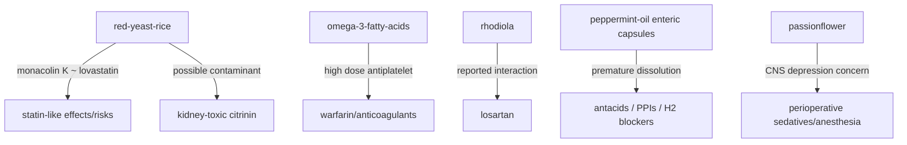

# The Hippie Scientist: Herb detail research shard (N-O-P-Q-R)

## Executive summary

This shard covers **14 common herbs/compounds** whose slug/name begins with **N, O, P, Q, or R**, selected because they have strong coverage in Tier‑1 sources—especially “Usefulness and Safety” fact sheets from entity["organization","National Center for Complementary and Integrative Health","nih complementary health center"], nutrient/supplement fact sheets from entity["organization","NIH Office of Dietary Supplements","nih dietary supplements office"], EU monographs from the entity["organization","European Medicines Agency","eu medicines regulator"], hepatic safety signal synthesis from entity["organization","LiverTox","niddk drug-induced liver injury db"], taxonomy/identity from entity["organization","Kew Plants of the World Online","kew powo plant taxonomy db"] and entity["organization","NCBI Taxonomy","ncbi organism taxonomy db"], and compound identity/markers from entity["organization","PubChem","nih chemical database"] / entity["organization","PubMed","nlm biomedical literature db"]. citeturn13view1turn13view2turn13view3turn13view4turn14view0turn14view1turn14view2turn14view3turn15view0turn18view2turn19view2turn9view0turn24view0turn12search0turn12search1turn11search0turn10search0turn17search0

Key cross‑shard takeaways:

- **Best “monograph-grade” dosing + precautions** in this shard: **nettle-root**, **peppermint-oil**, **passionflower** (all have EMA monographs with explicit posology and labeled limitations). citeturn9view0turn18view2turn19view2  
- **Highest regulatory/contamination complexity**: **red-yeast-rice** (statin-like active, highly variable content, FDA enforcement history, citrinin contamination concerns, rare hepatotoxicity signal). citeturn13view4turn12search1turn12search0  
- **Most interaction-relevant items**, where Tier‑1 sources explicitly flag interactions:  
  - **omega-3-fatty-acids ↔ warfarin/anticoagulants (high-dose antiplatelet effects, INR monitoring guidance)** citeturn38view2turn38view3  
  - **rhodiola ↔ losartan (reported interaction; supporting animal PK signal)** citeturn22view0turn12search6  
  - **peppermint-oil ↔ antacids / acid-suppressing meds (enteric coating release)** citeturn18view2  
  - **passionflower ↔ perioperative sedatives/anesthesia (CNS depression concern)** citeturn13view2  

### Quick comparison table

| slug | type | Overall confidence | Dosage field supported by Tier‑1? | Main safety anchor |
|---|---:|---:|---:|---|
| nettle-root | botanical | High | Yes (EMA) | EMA monograph |
| niacin | nutrient | Medium | Not extracted to numeric detail here (ODS exists) | ODS |
| noni | botanical | Medium | No | NCCIH + LiverTox |
| omega-3-fatty-acids | nutrient class | High | Yes (ODS; range + trial dosing) | ODS |
| passionflower | botanical | High | Yes (EMA) | NCCIH + EMA |
| peppermint-oil | botanical extract | High | Yes (EMA) | NCCIH + EMA |
| probiotics | microbial | Medium | No (strain/CFU uncertain) | NCCIH + ODS |
| pyridoxine | nutrient | High | Yes (ODS; includes clinical nausea regimen) | ODS |
| quercetin | compound | Medium | Yes (ODS notes trial dosing) | ODS |
| red-clover | botanical | Medium | No | NCCIH |
| red-yeast-rice | fungal fermentation product | High | No (content unpredictable) | NCCIH + LiverTox + FDA |
| resveratrol | compound | Medium | Yes (LiverTox summarizes trial dose ranges) | LiverTox |
| riboflavin | nutrient | Medium | Not extracted to numeric detail here (ODS exists) | ODS |
| rhodiola | botanical | Medium | No | NCCIH |

citeturn9view0turn13view3turn6search2turn14view1turn19view2turn18view2turn13view0turn16search0turn14view2turn15view0turn21view0turn13view4turn12search0turn12search1turn24view0turn14view3turn22view0

## Herb detail records

## nettle-root
Name: Nettle root  
Scientific name: Urtica dioica L.; Urtica urens L. (radix) citeturn8view0turn9view0  
Overall confidence: High

### Recommended field updates
- summary: Traditional herbal medicinal product for **relief of lower urinary tract symptoms related to benign prostatic hyperplasia (BPH)** after serious conditions have been excluded by a clinician (traditional use basis). citeturn9view0  
- description: Herbal substance/preparations include comminuted root and multiple dry/liquid extracts (various DERs and ethanol percentages) intended for oral use. citeturn9view0  
- mechanism: **Unresolved** (EMA monograph states pharmacodynamic data “not required” under the traditional registration pathway; no mechanism claim is endorsed in the monograph text). citeturn9view0  
- safetyNotes: GI complaints (e.g., nausea/heartburn/flatulence/diarrhea) and allergic reactions (pruritus/rash/urticaria) possible; seek medical evaluation if red-flag urinary symptoms occur (e.g., blood in urine, urinary retention, painful urination, fever). citeturn9view0  
- interactions: “None reported” in the EMA monograph. citeturn9view0  
- activeCompounds: **Unresolved** in this shard (EMA monograph excerpt used here does not enumerate marker constituents for field-ready chemistry). citeturn9view0  
- dosage: Adults/elderly men examples from EMA monograph include: **herbal infusion 2 g in 150 mL water, 2–3 times daily**; multiple extract-specific single daily dose (SD) / daily dose (DD) regimens are also listed and vary by preparation (DER/solvent). citeturn9view0  
- preparation: Oral use as infusion (“herbal tea”) or standardized extracts in solid/liquid dosage forms. citeturn9view0  
- region: Native range reported for **Urtica dioica** includes entity["place","Europe","continent"] to Siberia and W. China, plus NW. Africa; **Urtica urens** native range includes Europe to Siberia and Himalaya and parts of tropical Africa to the Arabian Peninsula. citeturn10search0turn10search1  

### Evidence notes
- What is strongly supported: Identity (botanical species used), BPH-related traditional indication, explicit posology options, “none reported” interactions, and labeled adverse effects/warnings are directly supported by the EMA monograph. citeturn9view0  
- What is only tentative/proposed: Any mechanistic explanation for urinary symptom relief is not established in the monograph and is not promoted here. citeturn9view0  
- What remains unresolved: Marker compounds for nettle root (for an “activeCompounds” list) within this shard’s extracted Tier‑1 evidence. citeturn9view0  

### Sources used
- European Union herbal monograph on *Urtica dioica* L.; *Urtica urens* L., radix (Final – Revision 1) - https://www.ema.europa.eu/en/documents/herbal-monograph/final-european-union-herbal-monograph-urtica-dioica-l-urtica-urens-l-radix-revision-1_en.pdf  
- Urticae radix (Nettle root) – EMA inventory page - https://www.ema.europa.eu/en/medicines/herbal/urticae-radix  
- *Urtica dioica* L. – POWO - https://powo.science.kew.org/taxon/urn%3Alsid%3Aipni.org%3Anames%3A260630-2  
- *Urtica urens* L. – POWO - https://powo.science.kew.org/taxon/urn%3Alsid%3Aipni.org%3Anames%3A857987-1  

### Field confidence
- summary: High  
- description: High  
- mechanism: Low  
- safetyNotes: High  
- interactions: High  
- activeCompounds: Low  
- dosage: High  
- preparation: High  
- region: High  

## niacin
Name: Niacin (Vitamin B3) citeturn14view0  
Scientific name: Not applicable  
Overall confidence: Medium

### Recommended field updates
- summary: Niacin is a **water‑soluble B vitamin** and a generic term covering **nicotinic acid, nicotinamide (niacinamide), and related derivatives**; present in foods and also sold as dietary supplements. citeturn14view0  
- description: In supplements, “niacin” may refer to different vitamers/derivatives (e.g., nicotinic acid vs. nicotinamide), which matters for effects and tolerability. citeturn14view0turn29search1  
- mechanism: Mechanism as a vitamin is **well-established biochemistry** (niacin vitamers support key metabolic cofactor pools; detailed pathway language should be pulled directly from ODS for JSON wording). citeturn14view0  
- safetyNotes: **Unresolved to specific cautions in this shard text extraction**; ODS provides the authoritative safety/adverse effects discussion and should be used as the final wording source for JSON. citeturn14view0  
- interactions: **Unresolved to specific named interactions here**; use ODS’s interactions section as the authoritative basis in Codex updates. citeturn14view0  
- activeCompounds: Niacin commonly maps to **nicotinic acid** (niacin) and **nicotinamide** (niacinamide); nicotinic acid compound identity is listed in PubChem/NCBI records as “nicotinic acid; niacin” (CID 938). citeturn14view0turn29search1  
- dosage: **Unresolved (do not enter numeric RDAs/ULs without direct extraction from ODS tables in your update step).** The ODS fact sheet is the correct numeric source. citeturn14view0  
- preparation: Oral supplements in varying chemical forms; food fortification and dietary sources also exist. citeturn14view0  
- region: Not applicable

### Evidence notes
- What is strongly supported: Identity and definition (vitamin B3; nicotinic acid/nicotinamide group). citeturn14view0turn29search1  
- What is only tentative/proposed: None asserted here.  
- What remains unresolved: Field-ready safetyNotes, interactions, and numeric dosage language—must be lifted directly from ODS for accuracy. citeturn14view0  

### Sources used
- Niacin – Health Professional Fact Sheet (ODS) - https://ods.od.nih.gov/factsheets/Niacin-HealthProfessional/  
- Nicotinic acid; niacin (CID 938) – NCBI/PubChem compound result - https://www.ncbi.nlm.nih.gov/pccompound/938  

### Field confidence
- summary: High  
- description: High  
- mechanism: Medium  
- safetyNotes: Low  
- interactions: Low  
- activeCompounds: High  
- dosage: Low  
- preparation: Medium  
- region: High  

## noni
Name: Noni citeturn13view3  
Scientific name: *Morinda citrifolia* L. citeturn10search2turn11search1  
Overall confidence: Medium

### Recommended field updates
- summary: Noni is promoted as a dietary supplement, but **human research is very limited** and has **not shown beneficial effects on any health condition** in studies of people (per NCCIH). citeturn13view3  
- description: Small evergreen tree; multiple plant parts (roots/stem/bark/leaves/flowers/fruit) have traditional medicinal uses; modern products include juices, teas, and extracts. citeturn13view3turn6search2  
- mechanism: **Proposed mechanism** (preclinical): antioxidant, immune‑modulating, antimicrobial/antifungal activities observed in laboratory research; these findings do not establish clinical efficacy. citeturn13view3  
- safetyNotes: NCCIH notes noni juice “might be safe” up to 3 months, but **cases of liver toxicity have been reported** with noni juice/tea; causality is unclear. LiverTox contains a dedicated noni record for hepatotoxicity context. citeturn13view3turn6search2  
- interactions: Unresolved (no specific Tier‑1 interaction statements extracted here beyond general supplement caution). citeturn13view3  
- activeCompounds: Unresolved (LiverTox treats noni as an herbal mixture; product chemistry varies). citeturn6search10turn6search2  
- dosage: Unresolved (no monograph-grade dosing in the Tier‑1 sources used here). citeturn13view3  
- preparation: Common supplement forms include juice and tea; also fruit extracts. citeturn13view3turn6search2  
- region: POWO lists native range as “Tropical & Subtropical Asia to N. Australia”; NCCIH also describes distribution including Pacific islands and parts of entity["place","Southeast Asia","region"] and entity["country","India","country"], and entity["country","Australia","country"]. citeturn10search2turn13view3  

### Evidence notes
- What is strongly supported: Limited/negative human evidence; preclinical activity only; liver-toxicity case reports with unclear causality. citeturn13view3turn6search2  
- What is only tentative/proposed: Any therapeutic mechanism beyond lab findings is not clinically established. citeturn13view3  
- What remains unresolved: Standardized active constituents and a reliable dose range across commercial products. citeturn13view3turn6search10  

### Sources used
- Noni: Usefulness and Safety (NCCIH) - https://www.nccih.nih.gov/health/noni  
- Noni (LiverTox) - https://www.ncbi.nlm.nih.gov/books/NBK548374/  
- *Morinda citrifolia* L. (POWO) - https://powo.science.kew.org/taxon/urn%3Alsid%3Aipni.org%3Anames%3A756359-1  
- *Morinda citrifolia* (NCBI Taxonomy) - https://www.ncbi.nlm.nih.gov/Taxonomy/Browser/wwwtax.cgi?id=43522&mode=Info  

### Field confidence
- summary: High  
- description: Medium  
- mechanism: Medium  
- safetyNotes: Medium  
- interactions: Low  
- activeCompounds: Low  
- dosage: Low  
- preparation: Medium  
- region: High  

## omega-3-fatty-acids
Name: Omega‑3 fatty acids citeturn37view0turn38view3  
Scientific name: Not applicable  
Overall confidence: High

### Recommended field updates
- summary: Omega‑3s are polyunsaturated fatty acids; most research focuses on **ALA, EPA, and DHA**, available from foods and supplements (e.g., fish oil). citeturn37view0turn37view3  
- description: ALA is an essential omega‑3; EPA/DHA are long‑chain omega‑3s commonly obtained from seafood/fish oils; ALA conversion to EPA/DHA is limited. citeturn37view3turn38view3  
- mechanism: **Proposed mechanism** (nutritional physiology): omega‑3s influence inflammatory signaling partly through competing eicosanoid pathways and effects on platelet aggregation and vascular tone (details summarized in ODS). citeturn37view3turn38view3  
- safetyNotes: ODS notes no UL established; very high EPA/DHA doses may increase bleeding time and could reduce immune function at certain high intakes; combined EPA+DHA up to ~5 g/day appears safe per EFSA and FDA conclusions, but some large trials reported a small increase in atrial fibrillation risk with 4 g/day long-term in high‑risk populations. citeturn38view3turn38view2  
- interactions: Warfarin/anticoagulants—fish oil may prolong clotting times at high doses; most research suggests 3–6 g/day fish oil does not significantly affect anticoagulant status, but monitoring INR is advised in relevant labeling contexts. citeturn38view2turn38view3  
- activeCompounds: ALA (e.g., “alpha-Linolenic acid”), EPA (“eicosapentaenoic acid”), DHA (“docosahexaenoic acid”). ALA compound identity is listed in NCBI/PubChem compound results (CID 5280934). citeturn37view0turn36search2turn37view3  
- dosage: ODS documents condition-specific trial dosing and wide ranges (e.g., historical CVD trials around 1 g/day; some clinical trials used 4 g/day omega‑3 for years); **no single universal supplement dose is endorsed** because outcomes vary by indication and formulation. citeturn37view3turn38view3  
- preparation: Common forms include fish oil, krill oil, and plant oils (ALA sources); EPA/DHA ultimately originate from marine microalgae in the food chain (per ODS description). citeturn37view3  
- region: Not applicable

### Evidence notes
- What is strongly supported: Definitions of the main omega‑3s; safety and interaction framing for anticoagulants; high-dose considerations and observed A‑fib signal in high‑risk groups. citeturn37view0turn38view3turn38view2  
- What is only tentative/proposed: Broad disease-prevention claims across many conditions remain mixed; ODS emphasizes heterogeneity of findings across outcomes. citeturn38view0  
- What remains unresolved: Optimal dose/composition for many non‑approved indications and patient subgroups. citeturn37view3turn38view3  

### Sources used
- Omega‑3 Fatty Acids – Health Professional Fact Sheet (ODS) - https://ods.od.nih.gov/factsheets/Omega3FattyAcids-HealthProfessional/  
- Alpha‑linolenic acid / linolenic acid (CID 5280934) – NCBI/PubChem compound result - https://www.ncbi.nlm.nih.gov/pccompound/5280934  

### Field confidence
- summary: High  
- description: High  
- mechanism: Medium  
- safetyNotes: High  
- interactions: High  
- activeCompounds: High  
- dosage: Medium  
- preparation: High  
- region: High  

## passionflower
Name: Passionflower citeturn13view2turn19view2  
Scientific name: *Passiflora incarnata* L. citeturn17search2turn19view2  
Overall confidence: High

### Recommended field updates
- summary: Evidence in people is limited; NCCIH reports a small amount of research suggesting oral passionflower may improve total sleep time in adults with insomnia, but effects on sleep onset/maintenance are mixed. citeturn13view2  
- description: EMA defines the herbal substance as fragmented/cut dried aerial parts; pharmacopoeial quality includes a minimum total flavonoid content expressed as vitexin, and extracts also standardized to flavonoids (vitexin equivalents). citeturn20view0turn19view2  
- mechanism: **Proposed mechanism**: EMA assessment describes preclinical signals consistent with modulation of the GABAergic system (e.g., anxiolytic effect antagonized by flumazenil in animal work), but this does **not** constitute strong clinical proof. citeturn20view0turn20view1  
- safetyNotes: NCCIH notes tea use up to 7 nights and extract use up to 8 weeks “may be safe,” with possible drowsiness/dizziness/confusion; avoid in pregnancy (possible uterine contraction risk) and use caution near surgery. EMA monograph notes pregnancy/lactation safety not established and not recommended. citeturn13view2turn19view2turn19view2  
- interactions: NCCIH warns that taking passionflower near anesthesia/other perioperative meds may slow the nervous system too much; EMA monograph lists “none reported,” so interaction risk should be documented as **cautionary/uncertain**, with perioperative CNS depression as the main flagged concern. citeturn13view2turn19view2  
- activeCompounds: Flavonoids (notably C‑glycosides of apigenin/luteolin such as isovitexin/isoorientin and related compounds; vitexin used for expression), potential cyanogenic glycoside (gynocardin), trace beta‑carboline alkaloids (harman/harmol/harmalol—often undetectable in commercial materials), and trace essential oil components. citeturn20view0  
- dosage: EMA monograph includes herbal tea **1–2 g** comminuted herb in **150 mL** boiling water (posology details are preparation-specific; extract/tablet/capsule regimens also exist in EMA sources). citeturn19view2turn19view3  
- preparation: Tea (infusion), comminuted herb and standardized extracts in solid oral dosage forms; traditional use for mild mental stress and to aid sleep. citeturn19view2turn19view3turn13view2  
- region: POWO lists native range as Central & E. U.S.A. and Bermuda. citeturn17search2  

### Evidence notes
- What is strongly supported: Botanical identity, official EU traditional-use indication framing, and constituent classes (flavonoids expressed as vitexin) in EMA assessment; NCCIH’s limited/mixed sleep evidence summary and key safety cautions. citeturn20view0turn13view2turn19view2  
- What is only tentative/proposed: GABAergic mediation is presented via preclinical pharmacology (animal/slice data), not definitive clinical mechanism. citeturn20view0turn20view1  
- What remains unresolved: A single “best” clinical dose for insomnia/stress across product types; long‑term safety beyond short durations in common supplement use. citeturn13view2turn19view2  

### Sources used
- Passionflower: Usefulness and Safety (NCCIH) - https://www.nccih.nih.gov/health/passionflower  
- Community herbal monograph on *Passiflora incarnata* L., herba (EMA) - https://www.ema.europa.eu/en/documents/herbal-monograph/final-community-herbal-monograph-passiflora-incarnata-l-herba_en.pdf  
- Assessment report on *Passiflora incarnata* L., herba (EMA) - https://www.ema.europa.eu/en/documents/herbal-report/final-assessment-report-passiflora-incarnata-l-herba_en.pdf  
- *Passiflora incarnata* L. (POWO) - https://powo.science.kew.org/taxon/urn%3Alsid%3Aipni.org%3Anames%3A675096-1  

### Field confidence
- summary: Medium  
- description: High  
- mechanism: Medium  
- safetyNotes: High  
- interactions: Medium  
- activeCompounds: High  
- dosage: Medium  
- preparation: High  
- region: High  

## peppermint-oil
Name: Peppermint oil citeturn13view1turn18view2  
Scientific name: *Mentha × piperita* L. (essential oil) citeturn17search7turn18view2  
Overall confidence: High

### Recommended field updates
- summary: NCCIH: safe in commonly used doses; evidence supports some uses (e.g., certain GI contexts) but remains limited for many conditions. EMA: peppermint oil oral preparations may be used for minor GI spasms/flatulence/abdominal pain (notably IBS context) and topical use for mild headache relief (per monograph summary pages). citeturn13view1turn6search9turn18view2  
- description: Essential oil derived from *Mentha × piperita* (a hybrid; *M. aquatica × M. spicata* per POWO). Products include enteric-coated capsules and topical preparations. citeturn17search7turn18view2turn13view1  
- mechanism: **Proposed mechanism**: EMA notes topical peppermint oil produces a prolonged cold sensation by stimulation of cold‑sensitive receptors, giving an analgesic effect; GI symptom relief is consistent with antispasmodic use but should be labeled “proposed” unless tied to specific human mechanism studies. citeturn18view2  
- safetyNotes: NCCIH: oral side effects can include heartburn/nausea/abdominal pain/dry mouth; rare allergy; avoid applying to infants’/young children’s faces due to menthol inhalation risk. EMA: contraindications include children under 2 years (menthol reflex apnea/laryngospasm risk), certain biliary disorders; pregnancy/lactation safety not established (not recommended); avoid applying to broken/irritated skin. citeturn13view1turn18view2  
- interactions: EMA: food/antacids or acid‑reducing meds (H2 blockers/PPIs) can cause early release or premature dissolution of enteric coatings; should be avoided in that context. citeturn18view2  
- activeCompounds: Menthol is referenced as a key constituent relevant to adverse respiratory effects in small children (constituent-level safety relevance); broader oil chemistry not enumerated here as a field-ready list. citeturn13view1turn18view2  
- dosage: EMA monograph includes oral daily dose ranges for gastro‑resistant dosage forms (e.g., a daily dose stated as 0.24–0.48 mL for an indication in the monograph) and specifies topical use regimens for indications; dosing is preparation- and indication-specific and should be stored with preparation metadata. citeturn18view2  
- preparation: Enteric-coated oral capsules; topical/transdermal application for certain indications; peppermint tea from leaves is considered safe in typical consumption but large-amount long-term leaf safety is unknown. citeturn13view1turn18view2  
- region: POWO lists native range as Europe to Central Asia. citeturn17search7  

### Evidence notes
- What is strongly supported: Interaction specifics for enteric-coated capsules; child safety constraints related to menthol; monograph-level contraindications and dosing frameworks. citeturn18view2turn13view1  
- What is only tentative/proposed: Mechanistic explanations for GI benefits beyond traditional antispasmodic framing. citeturn18view2  
- What remains unresolved: A concise, stable activeCompound list suitable for standardized JSON without additional PubChem/PubMed extraction work. citeturn18view2turn13view1  

### Sources used
- Peppermint Oil: Usefulness and Safety (NCCIH) - https://www.nccih.nih.gov/health/peppermint-oil  
- EU herbal monograph on *Mentha × piperita* L., aetheroleum (EMA) - https://www.ema.europa.eu/en/documents/herbal-monograph/european-union-herbal-monograph-mentha-x-piperita-l-aetheroleum-revision-1_en.pdf  
- Menthae piperitae aetheroleum – EMA herbal overview - https://www.ema.europa.eu/en/medicines/herbal/menthae-piperitae-aetheroleum  
- *Mentha × piperita* L. (POWO) - https://powo.science.kew.org/taxon/urn%3Alsid%3Aipni.org%3Anames%3A450969-1  

### Field confidence
- summary: High  
- description: High  
- mechanism: Medium  
- safetyNotes: High  
- interactions: High  
- activeCompounds: Medium  
- dosage: Medium  
- preparation: High  
- region: High  

## probiotics
Name: Probiotics citeturn13view0turn16search0  
Scientific name: Not applicable  
Overall confidence: Medium

### Recommended field updates
- summary: Evidence depends on condition and strain; NCCIH summarizes moderate‑quality/tentative evidence for reducing antibiotic‑associated diarrhea risk in some populations and limited/uncertain findings in others, with dose/strain/duration often uncertain. citeturn13view0  
- description: Dietary supplement category containing live microorganisms (bacteria and/or yeasts); products vary substantially in composition and CFU counts across labels and studies. citeturn16search1turn13view0  
- mechanism: **Proposed mechanism**: act in the digestive tract by altering host‑microbe interactions and GI ecosystem function; conceptually supported but product/strain-specific. citeturn16search1turn13view0  
- safetyNotes: Generally safe for most people, but ODS notes systemic infection risks in immunocompromised or very ill individuals; NCCIH similarly emphasizes caution and uncertainty of optimal dosing/strain for specific outcomes. citeturn15view3turn13view0  
- interactions: ODS notes probiotics are not known to interact with medications in general, but antibiotics/antifungals might decrease effectiveness of some probiotics. citeturn15view0  
- activeCompounds: Not applicable as compounds; **active biological agents** commonly include strains of Lactobacillus and Bifidobacterium, among others, with condition-specific study histories (e.g., Bifidobacterium lactis mentioned in constipation studies summarized by NCCIH). citeturn13view0turn15view3  
- dosage: Unresolved (often expressed as CFU and strain-specific; NCCIH explicitly notes “types,” time taken, and “most appropriate doses” are uncertain in key contexts). citeturn13view0  
- preparation: Capsules, powders, and foods with added live cultures; product viability/label accuracy can vary by product class. citeturn16search1turn13view0  
- region: Not applicable

### Evidence notes
- What is strongly supported: Some human evidence exists for specific outcomes (e.g., antibiotic-associated diarrhea risk reduction) but is limited by heterogeneity and moderate quality; safety is generally good with specific high‑risk cautions. citeturn13view0turn15view3  
- What is only tentative/proposed: Broad “immune boosting” or generalized health claims without using strain/indication-specific evidence. citeturn16search1  
- What remains unresolved: A canonical “dosage” representation that works across strains/indications; stable active organism taxonomy for labeling beyond broad genera. citeturn13view0turn15view0  

### Sources used
- Probiotics: Usefulness and Safety (NCCIH) - https://www.nccih.nih.gov/health/probiotics-usefulness-and-safety  
- Probiotics – Health Professional Fact Sheet (ODS) - https://ods.od.nih.gov/factsheets/Probiotics-HealthProfessional/  
- Dietary Supplements in the Time of COVID‑19 – Health Professional Fact Sheet (ODS; probiotics + interactions notes) - https://ods.od.nih.gov/factsheets/COVID19-HealthProfessional/  

### Field confidence
- summary: Medium  
- description: Medium  
- mechanism: Medium  
- safetyNotes: Medium  
- interactions: Medium  
- activeCompounds: Medium  
- dosage: Low  
- preparation: Medium  
- region: High  

## pyridoxine
Name: Pyridoxine (Vitamin B6) citeturn14view2  
Scientific name: Not applicable  
Overall confidence: High

### Recommended field updates
- summary: Vitamin B6 is a water‑soluble vitamin; “vitamin B6” refers to a set of vitamers, with PLP/PMP as active coenzyme forms. citeturn14view2  
- description: ODS defines vitamin B6 as six compounds (pyridoxine, pyridoxal, pyridoxamine and their 5′‑phosphate esters). citeturn14view2  
- mechanism: Mechanism is well‑established nutrition biochemistry; ODS notes B6’s cofactor role in neurotransmitter biosynthesis as a plausible basis for certain symptom effects in trials. citeturn14view2  
- safetyNotes: Chronic very high intakes (reported 1–6 g/day for 12–40 months) can cause severe progressive sensory neuropathy; risk appears dose‑dependent and may improve with discontinuation. citeturn14view2  
- interactions: Some medications can contribute to deficiency over time (ODS notes antiepileptic drugs as an example); medication/supplement interaction specifics should be taken from ODS’s interactions sections during JSON drafting. citeturn14view2  
- activeCompounds: Pyridoxine, pyridoxal, pyridoxamine; pyridoxal‑5′‑phosphate (PLP) and pyridoxamine‑5′‑phosphate (PMP) as active coenzyme forms. citeturn14view2  
- dosage: ODS provides RDAs by life stage (example: adults 19–50 years 1.3 mg/day; men 51+ 1.7 mg/day; women 51+ 1.5 mg/day; pregnancy 1.9 mg/day; lactation 2.0 mg/day). ODS also notes an obstetrics guideline recommending 10–25 mg 3–4 times/day for nausea/vomiting in pregnancy (with caution re approaching UL). citeturn14view2  
- preparation: Oral supplements containing pyridoxine or other vitamers; also widely available in foods and fortified products. citeturn14view2  
- region: Not applicable

### Evidence notes
- What is strongly supported: Identity, vitamers, and adverse effect profile at very high chronic doses are strongly supported by ODS. citeturn14view2  
- What is only tentative/proposed: Use for specific non-deficiency conditions beyond guideline-supported indications should be treated as indication-specific and evidence-graded separately. citeturn14view2  
- What remains unresolved: None critical for base nutrient record, aside from medication interaction enumeration if desired in your schema. citeturn14view2  

### Sources used
- Vitamin B6 – Health Professional Fact Sheet (ODS) - https://ods.od.nih.gov/factsheets/VitaminB6-HealthProfessional/  

### Field confidence
- summary: High  
- description: High  
- mechanism: High  
- safetyNotes: High  
- interactions: Medium  
- activeCompounds: High  
- dosage: High  
- preparation: High  
- region: High  

## quercetin
Name: Quercetin citeturn15view0turn33search0  
Scientific name: Not applicable  
Overall confidence: Medium

### Recommended field updates
- summary: Quercetin is a flavonol/polyphenolic compound present in many foods; clinical trial results for upper respiratory tract infections are mixed and COVID‑19 evidence is limited. citeturn15view0  
- description: ODS describes quercetin as a flavonol present in many fruits/vegetables/spices/beverages; ODS notes low oral bioavailability (3–17%) and that lecithin formulations may increase bioavailability. citeturn15view0  
- mechanism: **Proposed mechanism**: antioxidant/antiviral/anti‑inflammatory/immunomodulatory effects; may inhibit platelet aggregation (mechanism relevance to interactions should be labeled theoretical unless clinically demonstrated). citeturn15view0  
- safetyNotes: ODS consumer-facing material states no serious adverse effects reported from quercetin supplements, but stomach upset can occur; evidence base for long-term high-dose safety remains limited. citeturn14view5turn15view0  
- interactions: **Cautionary** interaction logic: platelet aggregation inhibition suggests theoretical additive effects with antiplatelet/anticoagulant therapies; ODS emphasizes that many supplement interaction notes are based on indirect evidence and case reports. citeturn15view0turn14view4  
- activeCompounds: Quercetin (primary); note that studies sometimes evaluate quercetin alone or combined with vitamin C/niacin; glycosylated dietary forms exist (field-ready list should be kept minimal unless you explicitly model glycosides). citeturn15view0turn33search0  
- dosage: ODS notes trials evaluating **500–1,000 mg/day** quercetin for upper respiratory tract infection outcomes, with mixed results; COVID‑19 data remain limited. citeturn15view0turn14view5  
- preparation: Capsules/tablets; enhanced bioavailability formulations (e.g., lecithin complexes) are discussed in ODS. citeturn15view0  
- region: Not applicable

### Evidence notes
- What is strongly supported: Basic definition, low bioavailability, and the limited/mixed state of clinical evidence are clearly described by ODS. citeturn15view0turn14view4  
- What is only tentative/proposed: Mechanism claims are largely mechanistic/preclinical; clinical translation is not established for many outcomes. citeturn15view0  
- What remains unresolved: Long-term safety at high doses; robust clinical evidence for specific indications outside narrow trial contexts. citeturn15view0turn14view5  

### Sources used
- Dietary Supplements in the Time of COVID‑19 – Health Professional Fact Sheet (ODS; Quercetin section) - https://ods.od.nih.gov/factsheets/COVID19-HealthProfessional/  
- Dietary Supplements in the Time of COVID‑19 – Consumer PDF (ODS; quercetin safety/efficacy summary) - https://ods.od.nih.gov/pdf/factsheets/COVID-19-Consumer.pdf  
- Quercetin (PubChem compound page) - https://pubchem.ncbi.nlm.nih.gov/compound/Quercetin  

### Field confidence
- summary: Medium  
- description: High  
- mechanism: Medium  
- safetyNotes: Medium  
- interactions: Medium  
- activeCompounds: High  
- dosage: Medium  
- preparation: Medium  
- region: High  

## red-clover
Name: Red clover citeturn21view0  
Scientific name: *Trifolium pratense* L. citeturn21view0turn17search4  
Overall confidence: Medium

### Recommended field updates
- summary: Studied mainly for menopausal symptoms and lipids; NCCIH finds evidence **inconsistent** and not conclusive for benefits; may have cholesterol effects but more research needed. citeturn21view0  
- description: Legume; contains isoflavones structurally similar to estrogen; supplements promoted for women’s health. citeturn21view0  
- mechanism: **Proposed mechanism**: phytoestrogenic activity via isoflavone constituents (estrogen-like structural similarity). citeturn21view0  
- safetyNotes: NCCIH reports red clover extracts used in studies up to 2 years with apparent safety and generally well tolerated; may be unsafe in pregnancy/breastfeeding. citeturn21view0  
- interactions: Unresolved (tier‑1 sources cited here do not enumerate specific drug interaction pairs; do not infer estrogen/drug interactions without a Tier‑1 citation that explicitly states them). citeturn21view0  
- activeCompounds: Isoflavones (do not specify individual isoflavones without additional Tier‑1 chemistry references). citeturn21view0  
- dosage: Unresolved (no monograph-grade posology extracted here). citeturn21view0  
- preparation: Extracts/capsules marketed as dietary supplements for menopause-related symptoms and other uses. citeturn21view0  
- region: POWO lists native range including Macaronesia, NW. Africa, Europe to Mongolia and Himalaya. citeturn17search4  

### Evidence notes
- What is strongly supported: Identity, phytoestrogen framing, inconsistent efficacy results, and basic safety constraints (pregnancy/breastfeeding). citeturn21view0  
- What is only tentative/proposed: Any broader disease-prevention claims beyond studied outcomes. citeturn21view0  
- What remains unresolved: Dosing standardization, interactions list, and constituent-level marker list in this shard. citeturn21view0  

### Sources used
- Red Clover: Usefulness and Safety (NCCIH) - https://www.nccih.nih.gov/health/red-clover  
- *Trifolium pratense* L. (POWO) - https://powo.science.kew.org/taxon/urn%3Alsid%3Aipni.org%3Anames%3A523575-1  

### Field confidence
- summary: High  
- description: High  
- mechanism: Medium  
- safetyNotes: High  
- interactions: Low  
- activeCompounds: Medium  
- dosage: Low  
- preparation: Medium  
- region: High  

## red-yeast-rice
Name: Red yeast rice citeturn13view4turn12search0  
Scientific name: *Monascus purpureus* Went, 1895 (fermentation organism; product is fermented rice) citeturn11search0turn12search0  
Overall confidence: High

### Recommended field updates
- summary: Red yeast rice products may lower cholesterol **only when they contain meaningful amounts of monacolin K (lovastatin)**; product monacolin content is highly variable and often not labeled; FDA has acted against products with enhanced/added lovastatin as unapproved drugs. citeturn13view4turn12search1  
- description: Available as food/traditional preparations and dietary supplements; reddish color derives from the mold *Monascus purpureus*. citeturn12search0turn11search0turn13view4  
- mechanism: Mechanism depends on monacolin K content; NCCIH explains lovastatin (structurally identical to monacolin K) slows cholesterol production in the body, so products with substantial monacolin K act “statin-like.” citeturn13view4turn12search3  
- safetyNotes: NCCIH: statin-like side effects possible (muscle/kidney/liver damage) when significant monacolin K is present; citrinin contamination can damage kidneys; pregnancy/lactation not recommended (no studies). LiverTox: red yeast rice has rare reports of clinically apparent liver injury. citeturn13view4turn12search0  
- interactions: NCCIH: can have the same types of drug interactions as statins (because monacolin K is lovastatin-equivalent), and may interfere with certain medicines or increase side effect risks. citeturn13view4  
- activeCompounds: Monacolin K (= lovastatin; PubChem listing connects “Monacolin‑K” to lovastatin), plus potential contaminant **citrinin** (as a safety-relevant non-active constituent). citeturn13view4turn12search3  
- dosage: Unresolved for safe/standard dosing because (a) monacolin K content varies widely across products and (b) consumers typically cannot know monacolin content from labels. citeturn13view4  
- preparation: Fermented rice product; supplement capsules/tablets; labeling/content variability is a core feature for any preparation field. citeturn13view4turn12search1  
- region: Not applicable (product distributed commercially; taxonomy/organism identity from NCBI is independent of geography). citeturn11search0  

### Evidence notes
- What is strongly supported: Statin-like mechanism when monacolin K is present; high variability/label opacity; FDA enforcement context; citrinin contamination concerns; rare hepatotoxicity reports. citeturn13view4turn12search1turn12search0  
- What is only tentative/proposed: Claims of benefit for products with very low/undetectable monacolin K. citeturn13view4  
- What remains unresolved: Product-by-product dosing and risk stratification (cannot be reliably generalized). citeturn13view4  

### Sources used
- Red Yeast Rice: Usefulness and Safety (NCCIH) - https://www.nccih.nih.gov/health/red-yeast-rice  
- Red Yeast Rice (LiverTox) - https://www.ncbi.nlm.nih.gov/books/NBK548168/  
- FDA Science Forum page on red yeast rice adulteration detection - https://www.fda.gov/science-research/fda-science-forum/using-carbon-isotope-ratios-detect-adulteration-red-yeast-rice-supplements  
- *Monascus purpureus* (NCBI Taxonomy) - https://www.ncbi.nlm.nih.gov/Taxonomy/Browser/wwwtax.cgi?id=5098&mode=Info  
- Lovastatin / “Monacolin‑K” (PubChem) - https://pubchem.ncbi.nlm.nih.gov/compound/Monacolin-K  

### Field confidence
- summary: High  
- description: High  
- mechanism: High  
- safetyNotes: High  
- interactions: Medium  
- activeCompounds: High  
- dosage: Low  
- preparation: High  
- region: High  

## resveratrol
Name: Resveratrol citeturn24view0  
Scientific name: Not applicable  
Overall confidence: Medium

### Recommended field updates
- summary: Widely used supplement; LiverTox reports **no conclusive evidence of human benefit** and characterizes hepatotoxicity as unlikely, though rare mild enzyme elevations can occur at very high doses. citeturn24view0  
- description: Plant polyphenol (3,5,4’‑trihydroxystilbene) found notably in red grape skins and other fruits; available in multiple supplement preparations with variable purity and poor oral bioavailability. citeturn24view0turn28search4  
- mechanism: **Proposed mechanism**: antioxidant effects and upregulation of antioxidant enzymes; stimulation of SIRT1 and AMPK activity is described as a mechanistic hypothesis for metabolic effects observed in model systems. citeturn24view0  
- safetyNotes: LiverTox: generally few side effects; minor GI upset, nausea, headache, fatigue reported; high-dose 1.5–3 g/day can mildly raise ALT/AST without jaundice; overall likelihood score E (unlikely cause of clinically apparent liver injury). citeturn24view0  
- interactions: LiverTox notes “possible supplement‑drug interactions with estrogens and anticoagulants” (treat as cautionary; do not over-specify mechanisms). citeturn24view0  
- activeCompounds: Resveratrol itself exists in trans/cis forms; major circulating forms are conjugates (sulfated/glucuronidated), not free resveratrol. citeturn24view0turn28search4  
- dosage: LiverTox summarizes clinical trial dosing from 20 mg to 5 g/day; notes a typical OTC recommendation of 500 mg twice daily, with caveats about product purity and low bioavailability. citeturn24view0  
- preparation: Oral supplements in capsules/tablets; quality/purity variability is emphasized. citeturn24view0  
- region: Not applicable

### Evidence notes
- What is strongly supported: Hepatic safety framing (unlikely clinically apparent liver injury); high-dose mild enzyme elevation; broad uncertainty of clinical benefit. citeturn24view0  
- What is only tentative/proposed: Mechanism claims (SIRT1/AMPK) mainly inferred from preclinical/model data; clinical translation not established. citeturn24view0  
- What remains unresolved: Indication-specific efficacy and an optimal dose for any outcome. citeturn24view0  

### Sources used
- Resveratrol (LiverTox) - https://www.ncbi.nlm.nih.gov/books/NBK548465/  
- Resveratrol (CID 445154) – NCBI/PubChem compound result - https://www.ncbi.nlm.nih.gov/pccompound/445154  

### Field confidence
- summary: High  
- description: High  
- mechanism: Medium  
- safetyNotes: High  
- interactions: Medium  
- activeCompounds: Medium  
- dosage: Medium  
- preparation: Medium  
- region: High  

## riboflavin
Name: Riboflavin (Vitamin B2) citeturn14view3turn30search2  
Scientific name: Not applicable  
Overall confidence: Medium

### Recommended field updates
- summary: Riboflavin is a water‑soluble B vitamin available in foods and as a dietary supplement; it is an essential component of the coenzymes FMN and FAD. citeturn14view3  
- description: Nutrient ingredient; supplement forms provide riboflavin to support dietary adequacy. citeturn14view3  
- mechanism: Well‑established biochemical mechanism via FMN/FAD coenzyme roles (ODS provides authoritative language). citeturn14view3  
- safetyNotes: Unresolved here (ODS contains the detailed tolerance/safety discussion; do not fill without direct extraction). citeturn14view3  
- interactions: Unresolved here (pull from ODS during JSON drafting). citeturn14view3  
- activeCompounds: Riboflavin; metabolically relevant coenzyme forms FMN and FAD. citeturn14view3turn30search2  
- dosage: Unresolved numeric dosing in this shard extraction; should be extracted from ODS tables for RDAs (and UL if any) during the Codex update stage. citeturn14view3  
- preparation: Oral supplements; food sources and fortification described in ODS. citeturn14view3  
- region: Not applicable

### Evidence notes
- What is strongly supported: Identity and core biochemical role (FMN/FAD). citeturn14view3  
- What is only tentative/proposed: None asserted.  
- What remains unresolved: Field-ready numeric dosage, specific safety and interaction language without direct ODS extraction. citeturn14view3  

### Sources used
- Riboflavin – Health Professional Fact Sheet (ODS) - https://ods.od.nih.gov/factsheets/Riboflavin-HealthProfessional/  
- Riboflavin (CID 493570) – NCBI/PubChem compound result - https://www.ncbi.nlm.nih.gov/pccompound/493570  

### Field confidence
- summary: High  
- description: Medium  
- mechanism: High  
- safetyNotes: Low  
- interactions: Low  
- activeCompounds: High  
- dosage: Low  
- preparation: Medium  
- region: High  

## rhodiola
Name: Rhodiola citeturn22view0  
Scientific name: *Rhodiola rosea* L. citeturn22view0turn17search0  
Overall confidence: Medium

### Recommended field updates
- summary: NCCIH concludes there isn’t enough reliable evidence to determine whether rhodiola or its components are useful for any health-related purpose; human research is often low‑to‑moderate quality. citeturn22view0  
- description: Plant used traditionally in Russia/Scandinavia/parts of Europe; promoted for mood/cognition/energy/stress; POWO reports native range as subarctic & subalpine Northern Hemisphere. citeturn22view0turn17search0  
- mechanism: **Proposed mechanism**: standardized extracts are described in peer-reviewed literature as polyphenol‑rich; PubMed review notes **salidroside and tyrosol** as primary marker compounds of standardized *R. rosea* extracts, with additional phenylpropanoid markers such as rosavin frequently discussed in the literature. citeturn23search0turn23search1turn23search2turn23search3  
- safetyNotes: Possibly safe up to 12 weeks; NCCIH lists possible side effects (dizziness/headache/insomnia/dry mouth or excessive saliva) and notes limited pregnancy/breastfeeding safety information. citeturn22view0  
- interactions: NCCIH reports interactions with losartan have been reported; a PubMed-indexed rabbit pharmacokinetic study suggests *R. rosea* can alter losartan pharmacokinetics (animal data—do not claim direct human interaction magnitude). citeturn22view0turn12search6  
- activeCompounds: Salidroside (CID 159278), tyrosol (CID 10393), rosavin (CID 9823887) are commonly referenced marker constituents for *R. rosea* extracts. citeturn23search0turn23search2turn23search3turn23search1  
- dosage: Unresolved (NCCIH does not provide a standard dose; published trials vary and are not consolidated into a single recommended regimen in Tier‑1 sources used here). citeturn22view0  
- preparation: Typically root/rhizome extracts marketed as “arctic/golden root” supplements; product standardization and marker presence can vary across commercial extracts. citeturn22view0turn23search0  
- region: POWO reports “Subarctic & Subalpine Northern Hemisphere” as the native range. citeturn17search0  

### Evidence notes
- What is strongly supported: Insufficient evidence for efficacy; short‑term safety framing; losartan interaction flag (caution). citeturn22view0  
- What is only tentative/proposed: Mechanisms and marker-compound relevance to clinical outcomes remain proposed; losartan PK interaction evidence includes animal data. citeturn12search6turn23search0  
- What remains unresolved: A reliable clinical dosing recommendation and indication-specific efficacy. citeturn22view0  

### Sources used
- Rhodiola: Usefulness and Safety (NCCIH) - https://www.nccih.nih.gov/health/rhodiola  
- *Rhodiola rosea* L. (POWO) - https://powo.science.kew.org/taxon/urn%3Alsid%3Aipni.org%3Anames%3A315148-2  
- Rhodiola plants: Chemistry and biological activity (PubMed) - https://pubmed.ncbi.nlm.nih.gov/28911692/  
- Salidroside (PubChem) - https://pubchem.ncbi.nlm.nih.gov/compound/Salidroside  
- Tyrosol (PubChem) - https://pubchem.ncbi.nlm.nih.gov/compound/Tyrosol  
- Rosavin (PubChem) - https://pubchem.ncbi.nlm.nih.gov/compound/Rosavin  
- Pharmacokinetic interaction between losartan and *Rhodiola rosea* in rabbits (PubMed) - https://pubmed.ncbi.nlm.nih.gov/23327826/  

### Field confidence
- summary: High  
- description: High  
- mechanism: Medium  
- safetyNotes: High  
- interactions: Medium  
- activeCompounds: High  
- dosage: Low  
- preparation: Medium  
- region: High  

## Final shard summary

Completed herb slugs researched:
- nettle-root  
- niacin  
- noni  
- omega-3-fatty-acids  
- passionflower  
- peppermint-oil  
- probiotics  
- pyridoxine  
- quercetin  
- red-clover  
- red-yeast-rice  
- resveratrol  
- riboflavin  
- rhodiola  

Herbs skipped or left thin due to weak evidence:
- **niacin**: safetyNotes/interactions/dosage left non-numeric here to avoid misstatement without direct ODS table extraction (source exists; extraction needed). citeturn14view0  
- **riboflavin**: safetyNotes/interactions/dosage left without numeric detail here (source exists; extraction needed). citeturn14view3  
- **probiotics**: dosage field remains inherently difficult because CFU/strain/duration are highly indication-specific and explicitly uncertain in authoritative summaries. citeturn13view0turn15view0  

Most common unresolved fields across the shard:
- **dosage** (especially where products vary widely or where authoritative sources do not endorse a single regimen) citeturn13view4turn13view0turn22view0  
- **activeCompounds** (when authoritative monographs/fact sheets do not provide a stable marker list suitable for a concise JSON field without additional PubMed/PubChem synthesis) citeturn13view3turn18view2turn9view0  
- **interactions** (often cautionary/theoretical outside of a few explicitly flagged cases like omega‑3↔warfarin, rhodiola↔losartan, peppermint oil↔antacids) citeturn38view2turn22view0turn18view2  

Safe for Codex update note
- **Ready for JSON without speculative interpretation (high confidence fields)**:
  - nettle-root: summary, description, safetyNotes, interactions, dosage, preparation, region (mechanism and activeCompounds still conservative). citeturn9view0turn10search0turn10search1  
  - omega-3-fatty-acids: summary, description, safetyNotes, interactions, activeCompounds, preparation (dosage as “ranges/condition-specific,” not a single recommendation). citeturn37view0turn38view3turn38view2  
  - passionflower: description, activeCompounds, dosage (EMA), safetyNotes (NCCIH+EMA), region; mechanism as “proposed.” citeturn20view0turn19view2turn13view2turn17search2  
  - peppermint-oil: safetyNotes, interactions, dosage (EMA), region; mechanism as “proposed.” citeturn18view2turn13view1turn17search7  
  - red-yeast-rice: summary, description, mechanism (conditional on monacolin K), safetyNotes, interactions, activeCompounds, preparation (dosage intentionally “unresolved”). citeturn13view4turn12search0turn12search1turn12search3  
  - resveratrol: summary, description, safetyNotes, interactions (as cautionary), dosage ranges, activeCompounds (isomer note), preparation. citeturn24view0turn28search4  
  - pyridoxine: summary, description, mechanism, safetyNotes, activeCompounds, dosage, preparation. citeturn14view2  
- **Fields that should be held or updated only after direct table/section extraction**:
  - niacin: dosage (numeric), safetyNotes, interactions. citeturn14view0  
  - riboflavin: dosage (numeric), safetyNotes, interactions. citeturn14view3